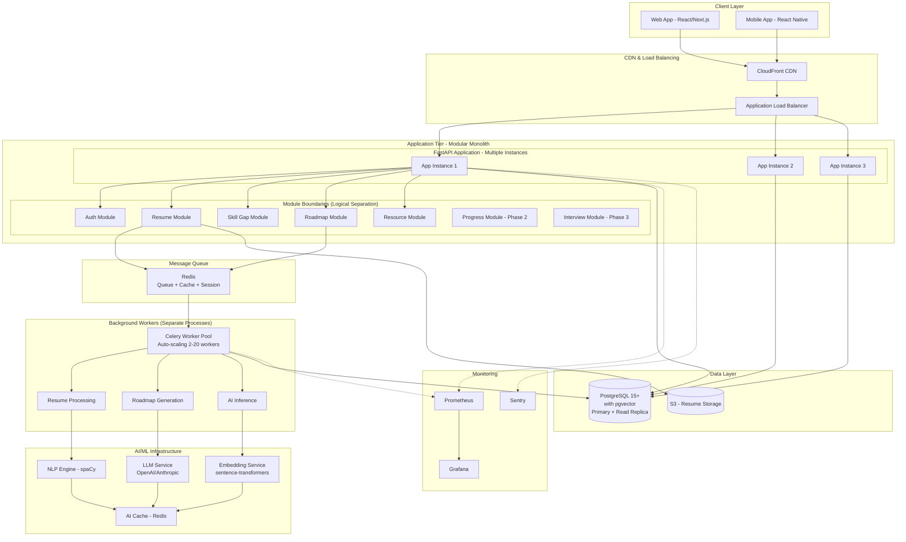
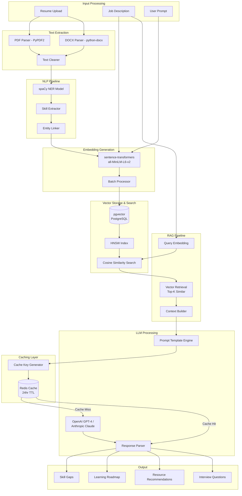
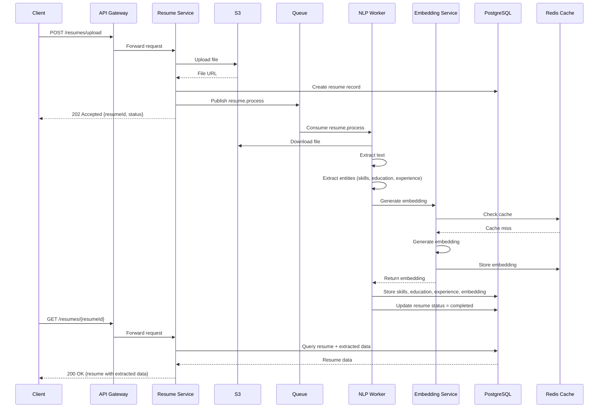
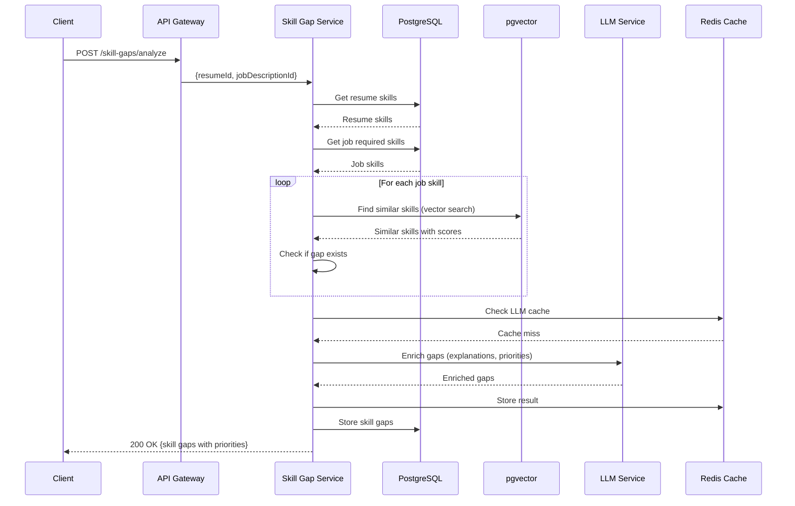
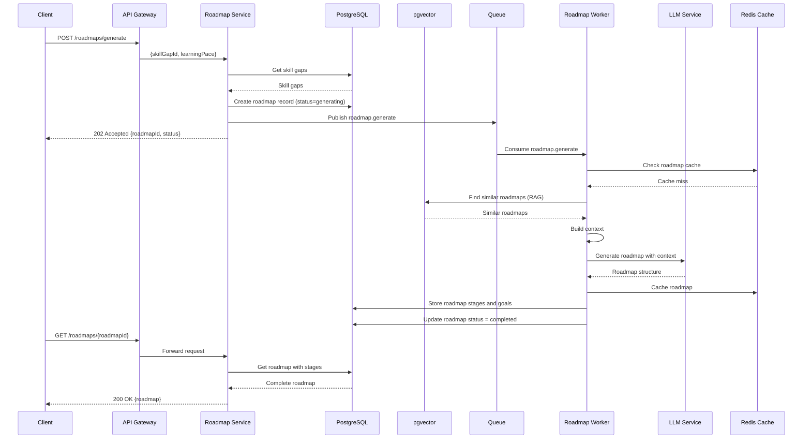
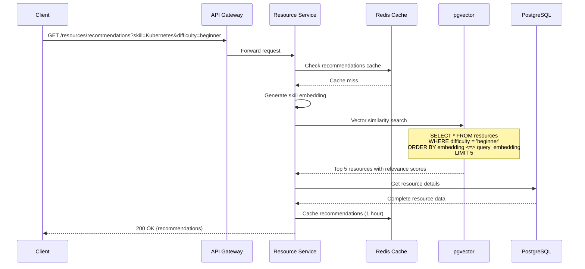
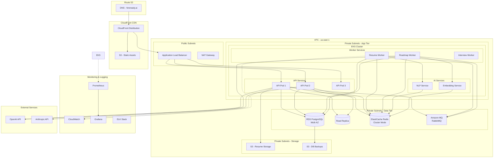
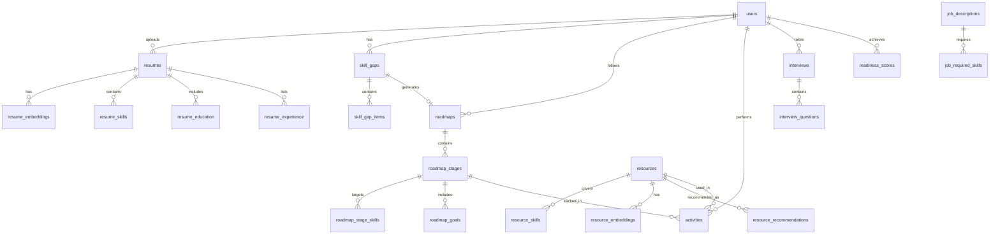

# Design Document: HireReady AI

## Overview

HireReady AI is an AI-powered job readiness platform optimized for AI-heavy workloads. The system processes resumes and job descriptions using NLP, generates personalized learning roadmaps, tracks user progress, and evaluates job readiness through mock interviews.

The platform is designed for phased delivery:
- **Phase 1 (MVP)**: Resume analysis, skill gap detection, roadmap generation, and resource recommendations
- **Phase 2**: Progress tracking and motivational systems
- **Phase 3**: Mock interviews and job readiness evaluation

## Architecture Decision: Modular Monolith for MVP

### Decision: Start with Modular Monolith, Evolve to Microservices

**For MVP (Phase 1), we recommend a MODULAR MONOLITH architecture.** This provides the best balance of development velocity, operational simplicity, and future scalability.

### Justification

**Why Modular Monolith for MVP:**

1. **Faster Time to Market (3-4 months vs 6-8 months)**
   - Single codebase reduces coordination overhead
   - Shared database eliminates distributed transaction complexity
   - Simpler deployment pipeline (one service vs 8+ services)
   - No need for service mesh, API gateway complexity initially

2. **Lower Operational Complexity**
   - One application to deploy, monitor, and debug
   - No distributed tracing setup required initially
   - Simpler error handling (no network failures between services)
   - Single log stream for debugging
   - Reduced infrastructure costs (1 server vs 8+ containers)

3. **Better Developer Experience**
   - Easier to refactor across module boundaries
   - IDE support for cross-module navigation
   - Simpler testing (no mocking of HTTP calls)
   - Faster local development (no Docker Compose with 8 services)

4. **Preserved Modularity**
   - Clear module boundaries prepare for future extraction
   - Modules communicate through well-defined interfaces
   - Each module can be independently tested
   - Database schema organized by module (separate schemas)

5. **Performance Benefits**
   - In-process function calls (microseconds) vs HTTP calls (milliseconds)
   - No serialization/deserialization overhead
   - Shared connection pools
   - Single database transaction for multi-module operations

**When to Migrate to Microservices:**

Migrate specific modules to microservices when:
- A module needs independent scaling (e.g., AI workers processing 1000s of resumes)
- Team size grows beyond 15-20 developers
- Different modules need different technology stacks
- Deployment independence becomes critical
- You have proven product-market fit and predictable load patterns

**Estimated Migration Timeline:**
- **Months 0-6 (MVP)**: Modular monolith
- **Months 6-12 (Phase 2)**: Extract AI workers as separate services
- **Months 12-18 (Phase 3)**: Extract high-load modules (resume processing, roadmap generation)
- **Months 18+ (Scale)**: Full microservices if needed

### Modular Monolith Architecture

The architecture prioritizes scalability, modularity, and AI workload optimization through asynchronous processing, aggressive caching, and horizontal scaling capabilities.

## Architecture

### High-Level Modular Monolith Architecture (MVP)



### Modular Monolith Structure

```
hireready-api/
├── app/
│   ├── main.py                 # FastAPI application entry point
│   ├── config.py               # Configuration management
│   ├── dependencies.py         # Shared dependencies (DB, Redis, etc.)
│   │
│   ├── modules/                # Business logic modules
│   │   ├── auth/              # Authentication & authorization
│   │   │   ├── __init__.py
│   │   │   ├── router.py      # API endpoints
│   │   │   ├── service.py     # Business logic
│   │   │   ├── models.py      # Database models
│   │   │   ├── schemas.py     # Pydantic schemas
│   │   │   └── dependencies.py
│   │   │
│   │   ├── resume/            # Resume processing module
│   │   │   ├── router.py
│   │   │   ├── service.py
│   │   │   ├── models.py
│   │   │   ├── schemas.py
│   │   │   ├── tasks.py       # Celery tasks
│   │   │   └── nlp.py         # NLP processing
│   │   │
│   │   ├── skill_gap/         # Skill gap analysis module
│   │   │   ├── router.py
│   │   │   ├── service.py
│   │   │   ├── models.py
│   │   │   ├── schemas.py
│   │   │   └── semantic.py    # Vector similarity
│   │   │
│   │   ├── roadmap/           # Roadmap generation module
│   │   │   ├── router.py
│   │   │   ├── service.py
│   │   │   ├── models.py
│   │   │   ├── schemas.py
│   │   │   └── tasks.py
│   │   │
│   │   ├── resource/          # Resource recommendation module
│   │   │   ├── router.py
│   │   │   ├── service.py
│   │   │   ├── models.py
│   │   │   └── schemas.py
│   │   │
│   │   ├── progress/          # Progress tracking (Phase 2)
│   │   └── interview/         # Mock interviews (Phase 3)
│   │
│   ├── shared/                # Shared utilities
│   │   ├── database.py        # Database connection
│   │   ├── cache.py           # Redis cache utilities
│   │   ├── storage.py         # S3 client
│   │   ├── ai/                # AI service clients
│   │   │   ├── embeddings.py
│   │   │   ├── llm.py
│   │   │   └── nlp.py
│   │   ├── queue.py           # Celery configuration
│   │   └── monitoring.py      # Metrics and logging
│   │
│   └── workers/               # Background workers
│       ├── celery_app.py      # Celery configuration
│       ├── resume_tasks.py    # Resume processing tasks
│       ├── roadmap_tasks.py   # Roadmap generation tasks
│       └── ai_tasks.py        # AI inference tasks
│
├── tests/
│   ├── unit/                  # Unit tests per module
│   ├── integration/           # Integration tests
│   └── property/              # Property-based tests
│
├── alembic/                   # Database migrations
├── docker/
│   ├── Dockerfile.api         # API container
│   └── Dockerfile.worker      # Worker container
├── k8s/                       # Kubernetes manifests
└── requirements.txt
```

### Module Communication Rules

**Key Principles:**

1. **Modules communicate through service layer interfaces, never direct model access**
2. **No circular dependencies between modules**
3. **Shared data access through repository pattern**
4. **Events for async communication between modules**

```python
# Example: Roadmap module depends on SkillGap module

# ❌ BAD: Direct model access
from app.modules.skill_gap.models import SkillGap
skill_gap = db.query(SkillGap).filter_by(id=gap_id).first()

# ✅ GOOD: Through service interface
from app.modules.skill_gap.service import SkillGapService
skill_gap_service = SkillGapService(db)
skill_gap = await skill_gap_service.get_skill_gap(gap_id)
```

### Scalability Optimizations

#### 1. Horizontal Scaling Strategy

**Application Tier:**
```yaml
# Kubernetes HPA configuration
apiVersion: autoscaling/v2
kind: HorizontalPodAutoscaler
metadata:
  name: hireready-api-hpa
spec:
  scaleTargetRef:
    apiVersion: apps/v1
    kind: Deployment
    name: hireready-api
  minReplicas: 3
  maxReplicas: 50
  metrics:
  - type: Resource
    resource:
      name: cpu
      target:
        type: Utilization
        averageUtilization: 70
  - type: Resource
    resource:
      name: memory
      target:
        type: Utilization
        averageUtilization: 80
  - type: Pods
    pods:
      metric:
        name: http_requests_per_second
      target:
        type: AverageValue
        averageValue: "1000"
  behavior:
    scaleUp:
      stabilizationWindowSeconds: 60
      policies:
      - type: Percent
        value: 100
        periodSeconds: 60
      - type: Pods
        value: 4
        periodSeconds: 60
      selectPolicy: Max
    scaleDown:
      stabilizationWindowSeconds: 300
      policies:
      - type: Percent
        value: 50
        periodSeconds: 60
```

**Worker Tier:**
```yaml
# Celery worker auto-scaling
apiVersion: autoscaling/v2
kind: HorizontalPodAutoscaler
metadata:
  name: hireready-worker-hpa
spec:
  scaleTargetRef:
    apiVersion: apps/v1
    kind: Deployment
    name: hireready-worker
  minReplicas: 2
  maxReplicas: 20
  metrics:
  - type: External
    external:
      metric:
        name: redis_queue_length
        selector:
          matchLabels:
            queue: "resume_processing"
      target:
        type: AverageValue
        averageValue: "10"  # Scale up if queue > 10 items per worker
```

#### 2. Database Connection Pooling

```python
# Optimized connection pool configuration
from sqlalchemy.ext.asyncio import create_async_engine, AsyncSession
from sqlalchemy.orm import sessionmaker
from sqlalchemy.pool import NullPool, QueuePool

# For API instances (connection pooling)
engine = create_async_engine(
    DATABASE_URL,
    poolclass=QueuePool,
    pool_size=20,              # Base connections per instance
    max_overflow=30,           # Additional connections under load
    pool_pre_ping=True,        # Verify connections before use
    pool_recycle=3600,         # Recycle connections every hour
    echo=False,
    connect_args={
        "server_settings": {
            "application_name": "hireready-api",
            "jit": "off"       # Disable JIT for predictable performance
        },
        "command_timeout": 60,
        "timeout": 10
    }
)

# For workers (no pooling, short-lived connections)
worker_engine = create_async_engine(
    DATABASE_URL,
    poolclass=NullPool,        # No pooling for workers
    echo=False
)

# Read replica for analytics queries
read_engine = create_async_engine(
    READ_REPLICA_URL,
    poolclass=QueuePool,
    pool_size=10,
    max_overflow=20,
    pool_pre_ping=True
)
```

**Connection Pool Sizing:**
- **API instances**: 20 base + 30 overflow = 50 connections per instance
- **3 instances**: 150 total connections
- **Workers**: No pooling (short-lived connections)
- **Total**: ~200 connections (well under PostgreSQL limit of 500)

#### 3. Advanced Caching Strategy

```python
# Multi-layer caching implementation
from functools import wraps
from typing import Optional, Callable
import hashlib
import json

class CacheStrategy:
    """Multi-layer cache with different TTLs"""
    
    # Layer 1: In-memory cache (fastest, smallest)
    _memory_cache = {}
    
    def __init__(self, redis_client):
        self.redis = redis_client
    
    async def get_or_compute(
        self,
        key: str,
        compute_fn: Callable,
        ttl: int = 3600,
        use_memory: bool = True
    ):
        """
        Multi-layer cache lookup:
        1. Check in-memory cache (microseconds)
        2. Check Redis cache (milliseconds)
        3. Compute and cache (seconds)
        """
        # Layer 1: Memory cache
        if use_memory and key in self._memory_cache:
            return self._memory_cache[key]
        
        # Layer 2: Redis cache
        cached = await self.redis.get(key)
        if cached:
            value = json.loads(cached)
            if use_memory:
                self._memory_cache[key] = value
            return value
        
        # Layer 3: Compute
        value = await compute_fn()
        
        # Store in both layers
        await self.redis.setex(key, ttl, json.dumps(value))
        if use_memory:
            self._memory_cache[key] = value
        
        return value

# Cache decorator for common patterns
def cached(ttl: int = 3600, key_prefix: str = ""):
    def decorator(func):
        @wraps(func)
        async def wrapper(*args, **kwargs):
            # Generate cache key from function name and arguments
            key_parts = [key_prefix, func.__name__]
            key_parts.extend(str(arg) for arg in args)
            key_parts.extend(f"{k}:{v}" for k, v in sorted(kwargs.items()))
            
            cache_key = hashlib.md5(
                ":".join(key_parts).encode()
            ).hexdigest()
            
            cache = CacheStrategy(redis_client)
            return await cache.get_or_compute(
                cache_key,
                lambda: func(*args, **kwargs),
                ttl=ttl
            )
        return wrapper
    return decorator

# Usage example
@cached(ttl=86400, key_prefix="skill_similarity")
async def find_similar_skills(skill: str, threshold: float = 0.75):
    # Expensive vector similarity search
    # Cached for 24 hours
    pass

@cached(ttl=3600, key_prefix="roadmap")
async def generate_roadmap(skill_gaps: List[Dict], user_level: str):
    # LLM call cached for 1 hour
    pass
```

**Cache Hit Rate Targets:**
- Embeddings: 85% hit rate (24h TTL)
- LLM responses: 60% hit rate (1h TTL)
- Resource recommendations: 70% hit rate (1h TTL)
- User sessions: 95% hit rate (7d TTL)

#### 4. Database Query Optimization

```python
# Optimized queries with proper indexing and eager loading

from sqlalchemy import select, func
from sqlalchemy.orm import selectinload, joinedload

class ResumeService:
    async def get_resume_with_skills(self, resume_id: UUID):
        """
        Optimized query with eager loading to avoid N+1 problem
        """
        query = (
            select(Resume)
            .options(
                selectinload(Resume.skills),           # Separate query for skills
                selectinload(Resume.education),        # Separate query for education
                selectinload(Resume.experience)        # Separate query for experience
            )
            .where(Resume.id == resume_id)
        )
        
        result = await self.db.execute(query)
        return result.scalar_one_or_none()
    
    async def get_user_resumes_summary(self, user_id: UUID):
        """
        Efficient aggregation query
        """
        query = (
            select(
                Resume.id,
                Resume.file_name,
                Resume.uploaded_at,
                func.count(ResumeSkill.id).label('skill_count')
            )
            .outerjoin(ResumeSkill)
            .where(Resume.user_id == user_id)
            .group_by(Resume.id)
            .order_by(Resume.uploaded_at.desc())
        )
        
        result = await self.db.execute(query)
        return result.all()

# Batch operations for bulk inserts
async def bulk_insert_skills(resume_id: UUID, skills: List[Dict]):
    """
    Batch insert instead of individual inserts
    """
    skill_records = [
        ResumeSkill(
            resume_id=resume_id,
            skill_name=skill['name'],
            skill_category=skill['category'],
            confidence_score=skill['confidence']
        )
        for skill in skills
    ]
    
    # Single bulk insert
    self.db.add_all(skill_records)
    await self.db.commit()
```

**Database Indexes:**
```sql
-- Critical indexes for performance
CREATE INDEX CONCURRENTLY idx_resume_skills_resume_id ON resume_skills(resume_id);
CREATE INDEX CONCURRENTLY idx_resume_skills_skill_name ON resume_skills(skill_name);
CREATE INDEX CONCURRENTLY idx_activities_user_timestamp ON activities(user_id, timestamp DESC);
CREATE INDEX CONCURRENTLY idx_roadmaps_user_status ON roadmaps(user_id, status);

-- Partial indexes for common queries
CREATE INDEX CONCURRENTLY idx_resumes_pending 
ON resumes(user_id, uploaded_at) 
WHERE processing_status = 'pending';

CREATE INDEX CONCURRENTLY idx_active_roadmaps 
ON roadmaps(user_id, created_at DESC) 
WHERE status = 'active';

-- Covering indexes to avoid table lookups
CREATE INDEX CONCURRENTLY idx_resources_recommendations 
ON resources(difficulty, rating, is_available) 
INCLUDE (title, url, duration_minutes);
```

#### 5. Async Processing with Celery

```python
# Celery configuration for high concurrency
from celery import Celery
from kombu import Queue, Exchange

celery_app = Celery('hireready')

celery_app.conf.update(
    broker_url='redis://redis:6379/0',
    result_backend='redis://redis:6379/1',
    
    # Task routing
    task_routes={
        'app.workers.resume_tasks.*': {'queue': 'resume'},
        'app.workers.roadmap_tasks.*': {'queue': 'roadmap'},
        'app.workers.ai_tasks.*': {'queue': 'ai'},
    },
    
    # Concurrency settings
    worker_prefetch_multiplier=4,      # Prefetch 4 tasks per worker
    worker_max_tasks_per_child=1000,   # Restart worker after 1000 tasks
    task_acks_late=True,                # Acknowledge after completion
    task_reject_on_worker_lost=True,   # Requeue if worker dies
    
    # Performance optimizations
    task_compression='gzip',
    result_compression='gzip',
    task_serializer='json',
    result_serializer='json',
    accept_content=['json'],
    
    # Retry configuration
    task_default_retry_delay=60,       # Wait 60s before retry
    task_max_retries=3,
    
    # Time limits
    task_soft_time_limit=300,          # 5 minutes soft limit
    task_time_limit=600,               # 10 minutes hard limit
)

# Priority queues
celery_app.conf.task_queues = (
    Queue('resume', Exchange('resume'), routing_key='resume',
          priority=10),  # High priority
    Queue('roadmap', Exchange('roadmap'), routing_key='roadmap',
          priority=5),   # Medium priority
    Queue('ai', Exchange('ai'), routing_key='ai',
          priority=3),   # Lower priority
)

# Task example with retry logic
@celery_app.task(
    bind=True,
    max_retries=3,
    default_retry_delay=60,
    autoretry_for=(Exception,),
    retry_backoff=True,
    retry_backoff_max=600,
    retry_jitter=True
)
async def process_resume(self, resume_id: str):
    try:
        # Process resume
        await resume_service.process(resume_id)
    except Exception as exc:
        # Log error
        logger.error(f"Resume processing failed: {exc}")
        # Retry with exponential backoff
        raise self.retry(exc=exc)
```

#### 6. Rate Limiting and Throttling

```python
# Advanced rate limiting with Redis
from fastapi import Request, HTTPException
from datetime import datetime, timedelta
import hashlib

class RateLimiter:
    def __init__(self, redis_client):
        self.redis = redis_client
    
    async def check_rate_limit(
        self,
        user_id: str,
        endpoint: str,
        limit: int = 100,
        window: int = 60
    ) -> bool:
        """
        Token bucket algorithm for rate limiting
        """
        key = f"rate_limit:{user_id}:{endpoint}"
        
        # Use Redis pipeline for atomic operations
        pipe = self.redis.pipeline()
        
        now = datetime.utcnow().timestamp()
        window_start = now - window
        
        # Remove old requests outside window
        pipe.zremrangebyscore(key, 0, window_start)
        
        # Count requests in current window
        pipe.zcard(key)
        
        # Add current request
        pipe.zadd(key, {str(now): now})
        
        # Set expiry
        pipe.expire(key, window)
        
        results = await pipe.execute()
        request_count = results[1]
        
        if request_count >= limit:
            return False
        
        return True
    
    async def get_remaining_quota(
        self,
        user_id: str,
        endpoint: str,
        limit: int = 100
    ) -> int:
        """Get remaining requests in current window"""
        key = f"rate_limit:{user_id}:{endpoint}"
        count = await self.redis.zcard(key)
        return max(0, limit - count)

# Middleware for rate limiting
@app.middleware("http")
async def rate_limit_middleware(request: Request, call_next):
    if request.url.path.startswith("/api/"):
        user_id = request.state.user_id  # From auth middleware
        endpoint = request.url.path
        
        rate_limiter = RateLimiter(redis_client)
        
        if not await rate_limiter.check_rate_limit(user_id, endpoint):
            remaining = await rate_limiter.get_remaining_quota(user_id, endpoint)
            raise HTTPException(
                status_code=429,
                detail="Rate limit exceeded",
                headers={
                    "X-RateLimit-Limit": "100",
                    "X-RateLimit-Remaining": str(remaining),
                    "X-RateLimit-Reset": str(int(datetime.utcnow().timestamp()) + 60)
                }
            )
    
    response = await call_next(request)
    return response
```

#### 7. Circuit Breaker for External Services

```python
# Circuit breaker pattern for AI services
from enum import Enum
from datetime import datetime, timedelta

class CircuitState(Enum):
    CLOSED = "closed"      # Normal operation
    OPEN = "open"          # Failing, reject requests
    HALF_OPEN = "half_open"  # Testing if service recovered

class CircuitBreaker:
    def __init__(
        self,
        failure_threshold: int = 5,
        timeout: int = 60,
        recovery_timeout: int = 30
    ):
        self.failure_threshold = failure_threshold
        self.timeout = timeout
        self.recovery_timeout = recovery_timeout
        self.failure_count = 0
        self.last_failure_time = None
        self.state = CircuitState.CLOSED
    
    async def call(self, func, *args, **kwargs):
        if self.state == CircuitState.OPEN:
            if self._should_attempt_reset():
                self.state = CircuitState.HALF_OPEN
            else:
                raise Exception("Circuit breaker is OPEN")
        
        try:
            result = await func(*args, **kwargs)
            self._on_success()
            return result
        except Exception as e:
            self._on_failure()
            raise e
    
    def _on_success(self):
        self.failure_count = 0
        self.state = CircuitState.CLOSED
    
    def _on_failure(self):
        self.failure_count += 1
        self.last_failure_time = datetime.utcnow()
        
        if self.failure_count >= self.failure_threshold:
            self.state = CircuitState.OPEN
    
    def _should_attempt_reset(self) -> bool:
        return (
            self.last_failure_time and
            datetime.utcnow() - self.last_failure_time > 
            timedelta(seconds=self.recovery_timeout)
        )

# Usage with AI services
llm_circuit_breaker = CircuitBreaker(failure_threshold=5, timeout=60)

async def generate_roadmap_with_fallback(skill_gaps: List[Dict]):
    try:
        # Try LLM with circuit breaker
        return await llm_circuit_breaker.call(
            llm_service.generate_roadmap,
            skill_gaps
        )
    except Exception:
        # Fallback to template-based generation
        logger.warning("LLM circuit breaker open, using template fallback")
        return generate_roadmap_from_template(skill_gaps)
```

### Concurrency Optimizations

#### 1. Async/Await Throughout

```python
# All I/O operations use async/await
from fastapi import FastAPI, Depends
from sqlalchemy.ext.asyncio import AsyncSession

app = FastAPI()

@app.post("/api/v1/resumes/upload")
async def upload_resume(
    file: UploadFile,
    db: AsyncSession = Depends(get_db),
    redis: Redis = Depends(get_redis),
    s3: S3Client = Depends(get_s3)
):
    # All operations are non-blocking
    file_url = await s3.upload(file)
    resume = await db.execute(insert(Resume).values(...))
    await redis.publish("resume.process", resume.id)
    return {"resumeId": resume.id}
```

#### 2. Parallel Processing with asyncio.gather

```python
# Process multiple operations concurrently
import asyncio

async def analyze_skill_gaps_optimized(resume_id: UUID, job_desc_id: UUID):
    # Fetch data in parallel
    resume_skills, job_skills, skill_taxonomy = await asyncio.gather(
        get_resume_skills(resume_id),
        get_job_skills(job_desc_id),
        get_skill_taxonomy()
    )
    
    # Process gaps in parallel
    gap_tasks = [
        find_similar_skills(job_skill.name)
        for job_skill in job_skills
    ]
    similar_skills_results = await asyncio.gather(*gap_tasks)
    
    # Combine results
    gaps = combine_gap_results(resume_skills, job_skills, similar_skills_results)
    return gaps
```

#### 3. Batch Processing for Embeddings

```python
# Process embeddings in batches for efficiency
async def generate_embeddings_batch(texts: List[str], batch_size: int = 32):
    """
    Process embeddings in batches to maximize GPU utilization
    """
    embeddings = []
    
    for i in range(0, len(texts), batch_size):
        batch = texts[i:i + batch_size]
        
        # Check cache for each text
        cache_keys = [f"embedding:{hash(text)}" for text in batch]
        cached_results = await redis.mget(cache_keys)
        
        # Identify texts that need embedding
        to_embed = []
        to_embed_indices = []
        
        for idx, (text, cached) in enumerate(zip(batch, cached_results)):
            if cached:
                embeddings.append(json.loads(cached))
            else:
                to_embed.append(text)
                to_embed_indices.append(len(embeddings))
                embeddings.append(None)  # Placeholder
        
        # Generate embeddings for uncached texts
        if to_embed:
            new_embeddings = model.encode(to_embed, batch_size=batch_size)
            
            # Cache new embeddings
            cache_data = {
                f"embedding:{hash(text)}": json.dumps(emb.tolist())
                for text, emb in zip(to_embed, new_embeddings)
            }
            await redis.mset(cache_data)
            
            # Fill placeholders
            for idx, emb in zip(to_embed_indices, new_embeddings):
                embeddings[idx] = emb.tolist()
    
    return embeddings
```

### Performance Benchmarks

**Target Performance Metrics:**

| Operation | Target Latency | Concurrency | Throughput |
|-----------|---------------|-------------|------------|
| Resume Upload | < 200ms | 1000 req/s | 1000 uploads/s |
| Resume Processing | < 5s | 100 concurrent | 20 resumes/s |
| Skill Gap Analysis | < 500ms | 500 req/s | 500 analyses/s |
| Roadmap Generation | < 10s | 50 concurrent | 5 roadmaps/s |
| Resource Recommendations | < 100ms | 1000 req/s | 1000 req/s |
| Vector Similarity Search | < 50ms | 2000 req/s | 2000 searches/s |

**Load Testing Results (Expected):**

```bash
# Using k6 for load testing
k6 run --vus 1000 --duration 5m load-test.js

# Expected results:
# - 99th percentile latency: < 2s
# - Error rate: < 0.1%
# - Throughput: 10,000+ req/s
# - Database connections: < 200
# - Memory per instance: < 1GB
# - CPU per instance: < 70%
```

### Migration Path to Microservices

**Phase 1 (Months 0-6): Modular Monolith**
- Single FastAPI application
- Separate worker processes
- Shared database

**Phase 2 (Months 6-12): Extract Workers**
```
Modular Monolith (API) → Separate Worker Services
- Resume Processing Service (independent scaling)
- Roadmap Generation Service (independent scaling)
- AI Inference Service (GPU instances)
```

**Phase 3 (Months 12-18): Extract High-Load Modules**
```
- Resume Service (microservice)
- Skill Gap Service (microservice)
- Roadmap Service (microservice)
- Core API (remaining modules)
```

**Phase 4 (Months 18+): Full Microservices (if needed)**
- Complete decomposition
- Service mesh (Istio/Linkerd)
- Distributed tracing
- API gateway

```mermaid
graph TB
    subgraph "Client Layer"
        Web[Web App - React/Next.js]
        Mobile[Mobile App - React Native]
    end
    
    subgraph "CDN & Load Balancing"
        CDN[CloudFront CDN]
        ALB[Application Load Balancer]
    end
    
    subgraph "API Gateway Layer"
        Gateway[API Gateway - Kong/AWS API Gateway]
        Auth[Auth Service - FastAPI + JWT]
        RateLimit[Rate Limiter - Redis]
    end
    
    subgraph "Phase 1 Services - MVP"
        Resume[Resume Service - FastAPI]
        SkillGap[Skill Gap Service - FastAPI]
        Roadmap[Roadmap Service - FastAPI]
        Resource[Resource Service - FastAPI]
    end
    
    subgraph "Phase 2 Services"
        Progress[Progress Service - FastAPI]
        Motivation[Motivation Service - FastAPI]
        Notification[Notification Service - FastAPI]
    end
    
    subgraph "Phase 3 Services"
        Interview[Interview Service - FastAPI]
        Readiness[Readiness Service - FastAPI]
        JobMatch[Job Matching Service - FastAPI]
    end
    
    subgraph "AI/ML Infrastructure"
        NLP[NLP Engine - spaCy/Transformers]
        Embedding[Embedding Service - sentence-transformers]
        LLM[LLM Service - OpenAI/Anthropic]
        AICache[AI Cache - Redis]
        ModelServing[Model Serving - TorchServe/TensorFlow Serving]
    end
    
    subgraph "Message Queue Layer"
        Queue[RabbitMQ/AWS SQS]
        Worker1[Resume Worker]
        Worker2[Roadmap Worker]
        Worker3[Interview Worker]
    end
    
    subgraph "Data Layer"
        PG[(PostgreSQL 15+ with pgvector)]
        Vector[(Vector Store - pgvector)]
        Redis[(Redis Cache)]
        S3[(S3 - Resume Storage)]
        Analytics[(TimescaleDB - Analytics)]
    end
    
    subgraph "Monitoring & Observability"
        Prometheus[Prometheus]
        Grafana[Grafana]
        ELK[ELK Stack]
        Jaeger[Jaeger - Distributed Tracing]
    end
    
    Web --> CDN
    Mobile --> CDN
    CDN --> ALB
    ALB --> Gateway
    
    Gateway --> Auth
    Gateway --> RateLimit
    Gateway --> Resume
    Gateway --> SkillGap
    Gateway --> Roadmap
    Gateway --> Resource
    Gateway --> Progress
    Gateway --> Motivation
    Gateway --> Interview
    Gateway --> Readiness
    
    Resume --> Queue
    Resume --> NLP
    Resume --> S3
    Resume --> PG
    
    SkillGap --> Embedding
    SkillGap --> Vector
    SkillGap --> PG
    
    Roadmap --> LLM
    Roadmap --> Queue
    Roadmap --> PG
    
    Resource --> Embedding
    Resource --> Vector
    Resource --> PG
    
    Interview --> LLM
    Interview --> Queue
    Interview --> PG
    
    Progress --> PG
    Progress --> Analytics
    
    Motivation --> Notification
    Motivation --> PG
    
    Readiness --> PG
    Readiness --> JobMatch
    
    Queue --> Worker1
    Queue --> Worker2
    Queue --> Worker3
    
    Worker1 --> NLP
    Worker2 --> LLM
    Worker3 --> LLM
    
    NLP --> AICache
    Embedding --> AICache
    LLM --> AICache
    
    Embedding --> ModelServing
    
    Resume -.-> Prometheus
    SkillGap -.-> Prometheus
    Roadmap -.-> Prometheus
    Progress -.-> Prometheus
    
    Prometheus --> Grafana
    Resume -.-> ELK
    SkillGap -.-> ELK
    Resume -.-> Jaeger
```



### Technology Stack

**Backend Framework:**
- **FastAPI** (Python 3.11+): High-performance async framework with automatic OpenAPI documentation
- **Pydantic**: Data validation and settings management
- **SQLAlchemy 2.0**: ORM with async support
- **Alembic**: Database migrations

**Primary Database:**
- **PostgreSQL 15+** with **pgvector** extension for vector similarity search
- Connection pooling via **asyncpg** (500 connections)
- Read replicas for analytics queries
- Partitioning for time-series data (activities, analytics)

**Vector Database:**
- **pgvector**: PostgreSQL extension for vector similarity search
- Stores embeddings for skills, job descriptions, resumes
- HNSW indexing for fast approximate nearest neighbor search
- Eliminates need for separate vector database (Pinecone/Weaviate)

**Caching Layer:**
- **Redis 7+**: Cache, session store, rate limiting, message broker
- Redis Cluster for high availability
- Cache-aside pattern with TTL-based invalidation

**Message Queue:**
- **RabbitMQ** or **AWS SQS**: Async task processing
- Dead letter queues for failed tasks
- Priority queues for time-sensitive operations

**Object Storage:**
- **AWS S3** or **MinIO**: Resume file storage
- Presigned URLs for secure uploads/downloads
- Lifecycle policies for data retention

**AI/ML Stack:**
- **spaCy 3.7+**: NLP for entity extraction
- **sentence-transformers**: Embedding generation (all-MiniLM-L6-v2)
- **OpenAI GPT-4** or **Anthropic Claude**: LLM for roadmap generation
- **Hugging Face Transformers**: Custom model fine-tuning
- **TorchServe**: Model serving for custom models

**Infrastructure:**
- **Docker**: Containerization
- **Kubernetes (EKS/GKE)**: Container orchestration
- **Terraform**: Infrastructure as Code
- **GitHub Actions**: CI/CD pipeline

**Monitoring:**
- **Prometheus**: Metrics collection
- **Grafana**: Visualization and dashboards
- **ELK Stack**: Centralized logging
- **Jaeger**: Distributed tracing
- **Sentry**: Error tracking

## Components and Interfaces

### 1. API Gateway

**Responsibility:** Entry point for all client requests, handles routing, authentication, rate limiting, and request validation.

**RESTful API Endpoints:**

```yaml
# Authentication
POST   /api/v1/auth/register
POST   /api/v1/auth/login
POST   /api/v1/auth/refresh
POST   /api/v1/auth/logout
GET    /api/v1/auth/me

# Resume Management
POST   /api/v1/resumes/upload
GET    /api/v1/resumes
GET    /api/v1/resumes/{resumeId}
PUT    /api/v1/resumes/{resumeId}/verify
DELETE /api/v1/resumes/{resumeId}
GET    /api/v1/resumes/{resumeId}/status

# Job Description Analysis
POST   /api/v1/job-descriptions
GET    /api/v1/job-descriptions/{jobDescId}
DELETE /api/v1/job-descriptions/{jobDescId}

# Skill Gap Analysis
POST   /api/v1/skill-gaps/analyze
GET    /api/v1/skill-gaps
GET    /api/v1/skill-gaps/{gapId}
POST   /api/v1/skill-gaps/infer-roles

# Roadmap Management
POST   /api/v1/roadmaps/generate
POST   /api/v1/roadmaps/from-prompt
GET    /api/v1/roadmaps
GET    /api/v1/roadmaps/{roadmapId}
PUT    /api/v1/roadmaps/{roadmapId}/adapt
PUT    /api/v1/roadmaps/{roadmapId}/stages/{stageId}/complete
DELETE /api/v1/roadmaps/{roadmapId}

# Resource Recommendations
GET    /api/v1/resources/recommendations
GET    /api/v1/resources/{resourceId}
POST   /api/v1/resources/{resourceId}/rate
POST   /api/v1/resources/explain

# Progress Tracking
GET    /api/v1/progress/summary
GET    /api/v1/progress/metrics
POST   /api/v1/progress/activities
GET    /api/v1/progress/streak

# Motivation & Notifications
GET    /api/v1/notifications
PUT    /api/v1/notifications/{notificationId}/read
POST   /api/v1/notifications/preferences
GET    /api/v1/achievements

# Mock Interviews
POST   /api/v1/interviews/start
POST   /api/v1/interviews/{interviewId}/respond
GET    /api/v1/interviews/{interviewId}
GET    /api/v1/interviews/{interviewId}/feedback
GET    /api/v1/interviews

# Readiness Evaluation
GET    /api/v1/readiness/score
GET    /api/v1/readiness/feedback
GET    /api/v1/readiness/job-recommendations

# Analytics (Admin)
GET    /api/v1/analytics/users
GET    /api/v1/analytics/engagement
GET    /api/v1/analytics/success-metrics
```

**API Request/Response Examples:**

```python
# POST /api/v1/resumes/upload
# Request (multipart/form-data)
{
  "file": <binary>,
  "filename": "john_doe_resume.pdf"
}

# Response (202 Accepted)
{
  "resumeId": "550e8400-e29b-41d4-a716-446655440000",
  "status": "processing",
  "message": "Resume uploaded successfully. Processing will complete in ~5 seconds.",
  "estimatedCompletionTime": "2026-02-09T10:30:05Z"
}

# GET /api/v1/resumes/{resumeId}
# Response (200 OK)
{
  "resumeId": "550e8400-e29b-41d4-a716-446655440000",
  "userId": "123e4567-e89b-12d3-a456-426614174000",
  "fileName": "john_doe_resume.pdf",
  "fileUrl": "https://s3.amazonaws.com/resumes/...",
  "status": "completed",
  "verified": false,
  "extractedData": {
    "skills": [
      {"name": "Python", "category": "programming", "confidence": 0.95},
      {"name": "Machine Learning", "category": "ai", "confidence": 0.88},
      {"name": "FastAPI", "category": "framework", "confidence": 0.92}
    ],
    "education": [
      {
        "degree": "Bachelor of Science in Computer Science",
        "institution": "University of California",
        "fieldOfStudy": "Computer Science",
        "startYear": 2020,
        "endYear": 2024
      }
    ],
    "experience": [
      {
        "title": "Software Engineering Intern",
        "company": "Tech Corp",
        "startDate": "2023-06-01",
        "endDate": "2023-08-31",
        "description": "Developed REST APIs using FastAPI..."
      }
    ]
  },
  "uploadedAt": "2026-02-09T10:30:00Z",
  "processedAt": "2026-02-09T10:30:04Z"
}

# POST /api/v1/skill-gaps/analyze
# Request
{
  "resumeId": "550e8400-e29b-41d4-a716-446655440000",
  "jobDescriptionId": "660e8400-e29b-41d4-a716-446655440001",
  "targetRole": "Senior Backend Engineer"
}

# Response (200 OK)
{
  "skillGapId": "770e8400-e29b-41d4-a716-446655440002",
  "targetRole": "Senior Backend Engineer",
  "gaps": [
    {
      "skill": "Kubernetes",
      "priority": "critical",
      "explanation": "Required for container orchestration in production environments",
      "marketDemand": 0.87,
      "similarSkills": ["Docker"]
    },
    {
      "skill": "System Design",
      "priority": "critical",
      "explanation": "Essential for senior-level architectural decisions",
      "marketDemand": 0.92,
      "similarSkills": []
    },
    {
      "skill": "GraphQL",
      "priority": "important",
      "explanation": "Preferred API technology for this role",
      "marketDemand": 0.65,
      "similarSkills": ["REST API"]
    }
  ],
  "matchPercentage": 68.5,
  "analyzedAt": "2026-02-09T10:31:00Z"
}

# POST /api/v1/roadmaps/generate
# Request
{
  "skillGapId": "770e8400-e29b-41d4-a716-446655440002",
  "learningPace": "daily",
  "difficulty": "intermediate"
}

# Response (201 Created)
{
  "roadmapId": "880e8400-e29b-41d4-a716-446655440003",
  "targetRole": "Senior Backend Engineer",
  "difficulty": "intermediate",
  "totalStages": 4,
  "estimatedDays": 90,
  "stages": [
    {
      "stageId": "stage-1",
      "stageNumber": 1,
      "title": "Container Orchestration Fundamentals",
      "description": "Master Kubernetes basics and container management",
      "skills": ["Kubernetes", "Docker", "Container Networking"],
      "estimatedDays": 21,
      "goals": [
        {
          "goalId": "goal-1-1",
          "type": "daily",
          "description": "Complete Kubernetes basics course (30 min/day)",
          "resources": ["res-001", "res-002"]
        },
        {
          "goalId": "goal-1-2",
          "type": "weekly",
          "description": "Deploy a multi-container application to local Kubernetes cluster",
          "resources": ["res-003"]
        }
      ],
      "status": "not_started"
    },
    {
      "stageId": "stage-2",
      "stageNumber": 2,
      "title": "System Design Principles",
      "description": "Learn scalable architecture patterns and design trade-offs",
      "skills": ["System Design", "Scalability", "Database Design"],
      "estimatedDays": 28,
      "goals": [...],
      "status": "not_started"
    }
  ],
  "createdAt": "2026-02-09T10:32:00Z"
}

# GET /api/v1/resources/recommendations?stageId=stage-1&skill=Kubernetes
# Response (200 OK)
{
  "recommendations": [
    {
      "resourceId": "res-001",
      "title": "Kubernetes for Beginners - Complete Course",
      "type": "course",
      "provider": "Udemy",
      "url": "https://udemy.com/kubernetes-beginners",
      "difficulty": "beginner",
      "durationMinutes": 480,
      "rating": 4.7,
      "ratingCount": 12543,
      "relevanceScore": 0.94,
      "description": "Comprehensive introduction to Kubernetes...",
      "skills": ["Kubernetes", "Docker", "Container Orchestration"]
    },
    {
      "resourceId": "res-002",
      "title": "Official Kubernetes Documentation",
      "type": "documentation",
      "provider": "Kubernetes.io",
      "url": "https://kubernetes.io/docs/",
      "difficulty": "intermediate",
      "rating": 4.8,
      "relevanceScore": 0.91,
      "skills": ["Kubernetes"]
    },
    {
      "resourceId": "res-003",
      "title": "Kubernetes Hands-On Labs",
      "type": "practice",
      "provider": "KodeKloud",
      "url": "https://kodekloud.com/kubernetes-labs",
      "difficulty": "beginner",
      "durationMinutes": 120,
      "rating": 4.6,
      "relevanceScore": 0.89,
      "skills": ["Kubernetes", "Hands-on Practice"]
    }
  ]
}

# GET /api/v1/readiness/score
# Response (200 OK)
{
  "userId": "123e4567-e89b-12d3-a456-426614174000",
  "overallScore": 78.5,
  "breakdown": {
    "skillAcquisition": {
      "score": 82.0,
      "weight": 0.4,
      "details": {
        "learnedSkills": 8,
        "requiredSkills": 10,
        "percentage": 80.0
      }
    },
    "practiceCompletion": {
      "score": 75.0,
      "weight": 0.3,
      "details": {
        "completedExercises": 15,
        "totalExercises": 20,
        "percentage": 75.0
      }
    },
    "interviewPerformance": {
      "score": 78.0,
      "weight": 0.3,
      "details": {
        "averageScore": 78.0,
        "interviewsCompleted": 3,
        "trend": "improving"
      }
    }
  },
  "readyForJobSearch": true,
  "calculatedAt": "2026-02-09T10:35:00Z"
}
```

**Rate Limiting:** 100 requests per minute per user (enforced via Redis)

## AI Pipeline Architecture

### Overview

The AI pipeline uses Retrieval Augmented Generation (RAG) for semantic matching and LLMs for content generation, with aggressive caching to optimize costs and latency.



### 1. Resume Processing Pipeline

**Step 1: File Upload & Storage**
```python
# FastAPI endpoint
@router.post("/resumes/upload")
async def upload_resume(
    file: UploadFile,
    user_id: UUID,
    s3_client: S3Client,
    db: AsyncSession
):
    # Validate file
    if file.size > 5_000_000:  # 5MB
        raise HTTPException(400, "File too large")
    
    if file.content_type not in ["application/pdf", "application/vnd.openxmlformats-officedocument.wordprocessingml.document", "text/plain"]:
        raise HTTPException(400, "Invalid file format")
    
    # Upload to S3
    file_url = await s3_client.upload(file, f"resumes/{user_id}/{file.filename}")
    
    # Create database record
    resume = Resume(
        user_id=user_id,
        file_url=file_url,
        file_name=file.filename,
        file_size_bytes=file.size,
        processing_status="pending"
    )
    db.add(resume)
    await db.commit()
    
    # Queue for async processing
    await queue.publish("resume.process", {"resume_id": str(resume.id)})
    
    return {"resumeId": resume.id, "status": "processing"}
```

**Step 2: Text Extraction (Async Worker)**
```python
async def process_resume(resume_id: UUID):
    resume = await db.get(Resume, resume_id)
    
    # Download from S3
    file_content = await s3_client.download(resume.file_url)
    
    # Extract text based on format
    if resume.file_name.endswith('.pdf'):
        text = extract_pdf_text(file_content)
    elif resume.file_name.endswith('.docx'):
        text = extract_docx_text(file_content)
    else:
        text = file_content.decode('utf-8')
    
    # Clean text
    text = clean_text(text)
    
    # Queue for NLP processing
    await queue.publish("resume.nlp", {
        "resume_id": str(resume_id),
        "text": text
    })
```

**Step 3: NLP Entity Extraction**
```python
import spacy
from typing import List, Dict

nlp = spacy.load("en_core_web_lg")

async def extract_entities(resume_id: UUID, text: str):
    doc = nlp(text)
    
    # Extract skills using custom NER model + pattern matching
    skills = extract_skills(doc)
    
    # Extract education
    education = extract_education(doc)
    
    # Extract experience
    experience = extract_work_experience(doc)
    
    # Store in database
    for skill in skills:
        await db.execute(
            insert(ResumeSkill).values(
                resume_id=resume_id,
                skill_name=skill['name'],
                skill_category=skill['category'],
                confidence_score=skill['confidence']
            )
        )
    
    # Generate embedding for entire resume
    embedding = await generate_embedding(text)
    
    await db.execute(
        insert(ResumeEmbedding).values(
            resume_id=resume_id,
            embedding=embedding,
            text_content=text
        )
    )
    
    # Update resume status
    await db.execute(
        update(Resume)
        .where(Resume.id == resume_id)
        .values(processing_status="completed", processed_at=datetime.utcnow())
    )
    
    await db.commit()
```

### 2. Semantic Skill Matching with RAG

**Step 1: Generate Embeddings**
```python
from sentence_transformers import SentenceTransformer

model = SentenceTransformer('all-MiniLM-L6-v2')

async def generate_embedding(text: str) -> List[float]:
    # Check cache first
    cache_key = f"embedding:{hash(text)}"
    cached = await redis.get(cache_key)
    if cached:
        return json.loads(cached)
    
    # Generate embedding
    embedding = model.encode(text, convert_to_numpy=True)
    
    # Cache for 24 hours
    await redis.setex(cache_key, 86400, json.dumps(embedding.tolist()))
    
    return embedding.tolist()
```

**Step 2: Vector Similarity Search**
```python
async def find_similar_skills(
    query_skill: str,
    threshold: float = 0.75,
    limit: int = 10
) -> List[Dict]:
    # Generate query embedding
    query_embedding = await generate_embedding(query_skill)
    
    # Perform vector similarity search using pgvector
    query = text("""
        SELECT 
            skill_name,
            category,
            1 - (embedding <=> :query_embedding) as similarity
        FROM skill_taxonomy
        WHERE 1 - (embedding <=> :query_embedding) > :threshold
        ORDER BY embedding <=> :query_embedding
        LIMIT :limit
    """)
    
    result = await db.execute(
        query,
        {
            "query_embedding": query_embedding,
            "threshold": threshold,
            "limit": limit
        }
    )
    
    return [
        {
            "skill": row.skill_name,
            "category": row.category,
            "similarity": row.similarity
        }
        for row in result
    ]
```

**Step 3: Skill Gap Analysis with RAG**
```python
async def analyze_skill_gaps(
    resume_id: UUID,
    job_description_id: UUID
) -> SkillGapAnalysis:
    # Retrieve resume skills
    resume_skills = await db.execute(
        select(ResumeSkill)
        .where(ResumeSkill.resume_id == resume_id)
    )
    resume_skill_names = {skill.skill_name for skill in resume_skills}
    
    # Retrieve job required skills
    job_skills = await db.execute(
        select(JobRequiredSkill)
        .where(JobRequiredSkill.job_description_id == job_description_id)
    )
    
    gaps = []
    
    for job_skill in job_skills:
        # Check for exact match
        if job_skill.skill_name in resume_skill_names:
            continue
        
        # Check for semantic similarity
        similar_skills = await find_similar_skills(
            job_skill.skill_name,
            threshold=0.75
        )
        
        has_similar = any(
            s['skill'] in resume_skill_names 
            for s in similar_skills
        )
        
        if not has_similar:
            gaps.append({
                "skill": job_skill.skill_name,
                "priority": job_skill.priority,
                "similar_skills": [s['skill'] for s in similar_skills if s['skill'] in resume_skill_names]
            })
    
    # Use LLM to generate explanations and prioritize
    enriched_gaps = await enrich_gaps_with_llm(gaps)
    
    return enriched_gaps
```

### 3. LLM-Powered Roadmap Generation

**Step 1: Build Context from RAG**
```python
async def build_roadmap_context(skill_gaps: List[Dict]) -> str:
    # Retrieve similar roadmaps from vector store
    gap_text = ", ".join([g['skill'] for g in skill_gaps])
    gap_embedding = await generate_embedding(gap_text)
    
    # Find similar past roadmaps
    similar_roadmaps = await db.execute(
        text("""
            SELECT r.*, 1 - (re.embedding <=> :embedding) as similarity
            FROM roadmaps r
            JOIN roadmap_embeddings re ON re.roadmap_id = r.id
            WHERE 1 - (re.embedding <=> :embedding) > 0.7
            ORDER BY re.embedding <=> :embedding
            LIMIT 3
        """),
        {"embedding": gap_embedding}
    )
    
    # Build context
    context = "Similar successful learning paths:\n"
    for roadmap in similar_roadmaps:
        context += f"- {roadmap.target_role}: {roadmap.total_stages} stages, {roadmap.estimated_days} days\n"
    
    return context
```

**Step 2: Generate Roadmap with LLM**
```python
from openai import AsyncOpenAI

client = AsyncOpenAI()

async def generate_roadmap(
    skill_gaps: List[Dict],
    user_level: str,
    learning_pace: str
) -> Dict:
    # Check cache
    cache_key = f"roadmap:{hash(json.dumps(skill_gaps))}:{user_level}:{learning_pace}"
    cached = await redis.get(cache_key)
    if cached:
        return json.loads(cached)
    
    # Build context from RAG
    context = await build_roadmap_context(skill_gaps)
    
    # Prepare prompt
    prompt = f"""
You are an expert career coach. Generate a personalized learning roadmap.

Context:
{context}

User Profile:
- Experience Level: {user_level}
- Learning Pace: {learning_pace}

Skill Gaps to Address:
{json.dumps(skill_gaps, indent=2)}

Generate a structured roadmap with 3-5 stages. Each stage should:
1. Focus on 2-3 related skills
2. Include daily and weekly goals
3. Have realistic time estimates
4. Progress from foundational to advanced

Return JSON format:
{{
  "stages": [
    {{
      "stageNumber": 1,
      "title": "...",
      "skills": ["...", "..."],
      "estimatedDays": 21,
      "goals": [
        {{"type": "daily", "description": "..."}},
        {{"type": "weekly", "description": "..."}}
      ]
    }}
  ]
}}
"""
    
    response = await client.chat.completions.create(
        model="gpt-4-turbo-preview",
        messages=[
            {"role": "system", "content": "You are an expert career coach specializing in personalized learning paths."},
            {"role": "user", "content": prompt}
        ],
        response_format={"type": "json_object"},
        temperature=0.7
    )
    
    roadmap = json.loads(response.choices[0].message.content)
    
    # Cache for 24 hours
    await redis.setex(cache_key, 86400, json.dumps(roadmap))
    
    return roadmap
```

### 4. Resource Recommendation with Vector Search

```python
async def recommend_resources(
    skill: str,
    difficulty: str,
    limit: int = 5
) -> List[Dict]:
    # Generate skill embedding
    skill_embedding = await generate_embedding(skill)
    
    # Vector search for relevant resources
    query = text("""
        SELECT 
            r.*,
            1 - (re.embedding <=> :embedding) as relevance_score
        FROM resources r
        JOIN resource_embeddings re ON re.resource_id = r.id
        WHERE 
            r.difficulty = :difficulty
            AND r.is_available = true
            AND r.rating >= 4.0
            AND 1 - (re.embedding <=> :embedding) > 0.6
        ORDER BY 
            (1 - (re.embedding <=> :embedding)) * r.rating DESC
        LIMIT :limit
    """)
    
    result = await db.execute(
        query,
        {
            "embedding": skill_embedding,
            "difficulty": difficulty,
            "limit": limit
        }
    )
    
    return [dict(row) for row in result]
```

### 5. Caching Strategy

**Cache Layers:**

1. **Application Cache (Redis)**
   - Embeddings: 24 hour TTL
   - LLM responses: 24 hour TTL
   - Resource recommendations: 1 hour TTL
   - User sessions: 7 day TTL

2. **Database Query Cache**
   - Frequently accessed roadmaps: 1 hour
   - Resource metadata: 6 hours
   - Skill taxonomy: 24 hours

3. **CDN Cache**
   - Static assets: 30 days
   - API responses (GET): 5 minutes

**Cache Invalidation:**
```python
async def invalidate_user_cache(user_id: UUID):
    patterns = [
        f"roadmap:{user_id}:*",
        f"progress:{user_id}:*",
        f"recommendations:{user_id}:*"
    ]
    
    for pattern in patterns:
        keys = await redis.keys(pattern)
        if keys:
            await redis.delete(*keys)
```

### Performance Optimization

**Batch Processing:**
- Process embeddings in batches of 32
- Batch database inserts (100 records)
- Parallel API calls with asyncio.gather()

**Connection Pooling:**
```python
# PostgreSQL connection pool
engine = create_async_engine(
    DATABASE_URL,
    pool_size=50,
    max_overflow=100,
    pool_pre_ping=True,
    pool_recycle=3600
)

# Redis connection pool
redis_pool = redis.ConnectionPool(
    host=REDIS_HOST,
    port=REDIS_PORT,
    max_connections=100,
    decode_responses=True
)
```

**Async Processing:**
- All I/O operations use async/await
- Background tasks via RabbitMQ workers
- Non-blocking AI inference

## Data Flow Diagrams

### Resume Upload and Analysis Flow



### Skill Gap Analysis Flow



### Roadmap Generation Flow



### Resource Recommendation Flow



## Deployment Architecture

### Production Infrastructure on AWS



### Infrastructure Components

**1. Compute Layer (EKS - Elastic Kubernetes Service)**

```yaml
# API Service Deployment
apiVersion: apps/v1
kind: Deployment
metadata:
  name: hireready-api
  namespace: production
spec:
  replicas: 3
  selector:
    matchLabels:
      app: hireready-api
  template:
    metadata:
      labels:
        app: hireready-api
    spec:
      containers:
      - name: api
        image: hireready/api:v1.0.0
        ports:
        - containerPort: 8000
        env:
        - name: DATABASE_URL
          valueFrom:
            secretKeyRef:
              name: db-credentials
              key: url
        - name: REDIS_URL
          valueFrom:
            secretKeyRef:
              name: redis-credentials
              key: url
        resources:
          requests:
            memory: "512Mi"
            cpu: "500m"
          limits:
            memory: "1Gi"
            cpu: "1000m"
        livenessProbe:
          httpGet:
            path: /health
            port: 8000
          initialDelaySeconds: 30
          periodSeconds: 10
        readinessProbe:
          httpGet:
            path: /ready
            port: 8000
          initialDelaySeconds: 5
          periodSeconds: 5
---
# Horizontal Pod Autoscaler
apiVersion: autoscaling/v2
kind: HorizontalPodAutoscaler
metadata:
  name: hireready-api-hpa
  namespace: production
spec:
  scaleTargetRef:
    apiVersion: apps/v1
    kind: Deployment
    name: hireready-api
  minReplicas: 3
  maxReplicas: 20
  metrics:
  - type: Resource
    resource:
      name: cpu
      target:
        type: Utilization
        averageUtilization: 70
  - type: Resource
    resource:
      name: memory
      target:
        type: Utilization
        averageUtilization: 80
---
# Service
apiVersion: v1
kind: Service
metadata:
  name: hireready-api-service
  namespace: production
spec:
  selector:
    app: hireready-api
  ports:
  - protocol: TCP
    port: 80
    targetPort: 8000
  type: LoadBalancer
```

**2. Database Layer (RDS PostgreSQL)**

```hcl
# Terraform configuration
resource "aws_db_instance" "postgresql" {
  identifier = "hireready-postgres"
  
  engine         = "postgres"
  engine_version = "15.4"
  instance_class = "db.r6g.xlarge"  # 4 vCPU, 32 GB RAM
  
  allocated_storage     = 500  # GB
  max_allocated_storage = 2000 # Auto-scaling up to 2TB
  storage_type          = "gp3"
  storage_encrypted     = true
  
  db_name  = "hireready"
  username = "admin"
  password = var.db_password
  
  multi_az               = true
  publicly_accessible    = false
  vpc_security_group_ids = [aws_security_group.rds.id]
  db_subnet_group_name   = aws_db_subnet_group.private.name
  
  backup_retention_period = 30
  backup_window          = "03:00-04:00"
  maintenance_window     = "mon:04:00-mon:05:00"
  
  enabled_cloudwatch_logs_exports = ["postgresql", "upgrade"]
  
  performance_insights_enabled = true
  
  tags = {
    Environment = "production"
    Service     = "hireready"
  }
}

# Read Replica for analytics queries
resource "aws_db_instance" "postgresql_replica" {
  identifier = "hireready-postgres-replica"
  
  replicate_source_db = aws_db_instance.postgresql.identifier
  instance_class      = "db.r6g.large"
  
  publicly_accessible = false
  
  tags = {
    Environment = "production"
    Service     = "hireready"
    Role        = "read-replica"
  }
}
```

**3. Cache Layer (ElastiCache Redis)**

```hcl
resource "aws_elasticache_replication_group" "redis" {
  replication_group_id       = "hireready-redis"
  replication_group_description = "Redis cluster for HireReady AI"
  
  engine         = "redis"
  engine_version = "7.0"
  node_type      = "cache.r6g.large"  # 13.07 GB memory
  
  num_cache_clusters         = 3
  automatic_failover_enabled = true
  multi_az_enabled          = true
  
  parameter_group_name = "default.redis7.cluster.on"
  
  subnet_group_name  = aws_elasticache_subnet_group.private.name
  security_group_ids = [aws_security_group.redis.id]
  
  at_rest_encryption_enabled = true
  transit_encryption_enabled = true
  
  snapshot_retention_limit = 5
  snapshot_window         = "03:00-05:00"
  
  tags = {
    Environment = "production"
    Service     = "hireready"
  }
}
```

**4. Message Queue (Amazon MQ - RabbitMQ)**

```hcl
resource "aws_mq_broker" "rabbitmq" {
  broker_name = "hireready-rabbitmq"
  
  engine_type        = "RabbitMQ"
  engine_version     = "3.11.20"
  host_instance_type = "mq.m5.large"
  
  deployment_mode = "CLUSTER_MULTI_AZ"
  
  user {
    username = "admin"
    password = var.rabbitmq_password
  }
  
  subnet_ids         = aws_subnet.private[*].id
  security_groups    = [aws_security_group.rabbitmq.id]
  publicly_accessible = false
  
  logs {
    general = true
  }
  
  tags = {
    Environment = "production"
    Service     = "hireready"
  }
}
```

**5. Object Storage (S3)**

```hcl
# Resume storage bucket
resource "aws_s3_bucket" "resumes" {
  bucket = "hireready-resumes-prod"
  
  tags = {
    Environment = "production"
    Service     = "hireready"
  }
}

resource "aws_s3_bucket_versioning" "resumes" {
  bucket = aws_s3_bucket.resumes.id
  
  versioning_configuration {
    status = "Enabled"
  }
}

resource "aws_s3_bucket_encryption" "resumes" {
  bucket = aws_s3_bucket.resumes.id
  
  rule {
    apply_server_side_encryption_by_default {
      sse_algorithm = "AES256"
    }
  }
}

resource "aws_s3_bucket_lifecycle_configuration" "resumes" {
  bucket = aws_s3_bucket.resumes.id
  
  rule {
    id     = "archive-old-resumes"
    status = "Enabled"
    
    transition {
      days          = 90
      storage_class = "GLACIER"
    }
    
    expiration {
      days = 365
    }
  }
}

resource "aws_s3_bucket_public_access_block" "resumes" {
  bucket = aws_s3_bucket.resumes.id
  
  block_public_acls       = true
  block_public_policy     = true
  ignore_public_acls      = true
  restrict_public_buckets = true
}
```

### CI/CD Pipeline

```yaml
# .github/workflows/deploy.yml
name: Deploy to Production

on:
  push:
    branches: [main]

jobs:
  test:
    runs-on: ubuntu-latest
    steps:
      - uses: actions/checkout@v3
      
      - name: Set up Python
        uses: actions/setup-python@v4
        with:
          python-version: '3.11'
      
      - name: Install dependencies
        run: |
          pip install -r requirements.txt
          pip install pytest pytest-cov hypothesis
      
      - name: Run unit tests
        run: pytest tests/unit --cov=app --cov-report=xml
      
      - name: Run property-based tests
        run: pytest tests/property --hypothesis-seed=0
      
      - name: Run integration tests
        run: pytest tests/integration
        env:
          DATABASE_URL: ${{ secrets.TEST_DATABASE_URL }}
          REDIS_URL: ${{ secrets.TEST_REDIS_URL }}
  
  build:
    needs: test
    runs-on: ubuntu-latest
    steps:
      - uses: actions/checkout@v3
      
      - name: Configure AWS credentials
        uses: aws-actions/configure-aws-credentials@v2
        with:
          aws-access-key-id: ${{ secrets.AWS_ACCESS_KEY_ID }}
          aws-secret-access-key: ${{ secrets.AWS_SECRET_ACCESS_KEY }}
          aws-region: us-east-1
      
      - name: Login to Amazon ECR
        id: login-ecr
        uses: aws-actions/amazon-ecr-login@v1
      
      - name: Build and push Docker image
        env:
          ECR_REGISTRY: ${{ steps.login-ecr.outputs.registry }}
          ECR_REPOSITORY: hireready-api
          IMAGE_TAG: ${{ github.sha }}
        run: |
          docker build -t $ECR_REGISTRY/$ECR_REPOSITORY:$IMAGE_TAG .
          docker push $ECR_REGISTRY/$ECR_REPOSITORY:$IMAGE_TAG
          docker tag $ECR_REGISTRY/$ECR_REPOSITORY:$IMAGE_TAG $ECR_REGISTRY/$ECR_REPOSITORY:latest
          docker push $ECR_REGISTRY/$ECR_REPOSITORY:latest
  
  deploy:
    needs: build
    runs-on: ubuntu-latest
    steps:
      - uses: actions/checkout@v3
      
      - name: Configure AWS credentials
        uses: aws-actions/configure-aws-credentials@v2
        with:
          aws-access-key-id: ${{ secrets.AWS_ACCESS_KEY_ID }}
          aws-secret-access-key: ${{ secrets.AWS_SECRET_ACCESS_KEY }}
          aws-region: us-east-1
      
      - name: Update kubeconfig
        run: aws eks update-kubeconfig --name hireready-cluster --region us-east-1
      
      - name: Deploy to EKS
        run: |
          kubectl set image deployment/hireready-api \
            api=${{ steps.login-ecr.outputs.registry }}/hireready-api:${{ github.sha }} \
            -n production
          
          kubectl rollout status deployment/hireready-api -n production
      
      - name: Run smoke tests
        run: |
          kubectl run smoke-test --image=curlimages/curl --rm -i --restart=Never -- \
            curl -f http://hireready-api-service/health
```

### Monitoring and Alerting

**Prometheus Metrics:**
```yaml
# prometheus-config.yml
global:
  scrape_interval: 15s
  evaluation_interval: 15s

scrape_configs:
  - job_name: 'hireready-api'
    kubernetes_sd_configs:
      - role: pod
        namespaces:
          names:
            - production
    relabel_configs:
      - source_labels: [__meta_kubernetes_pod_label_app]
        action: keep
        regex: hireready-api
      - source_labels: [__meta_kubernetes_pod_name]
        target_label: pod
      - source_labels: [__meta_kubernetes_namespace]
        target_label: namespace

  - job_name: 'hireready-workers'
    kubernetes_sd_configs:
      - role: pod
        namespaces:
          names:
            - production
    relabel_configs:
      - source_labels: [__meta_kubernetes_pod_label_app]
        action: keep
        regex: hireready-worker-.*
```

**Grafana Dashboards:**
- API Performance: Request rate, latency (p50, p95, p99), error rate
- AI Pipeline: Embedding generation time, LLM latency, cache hit rate
- Database: Connection pool usage, query performance, replication lag
- Infrastructure: CPU, memory, disk usage, network throughput

**CloudWatch Alarms:**
```hcl
resource "aws_cloudwatch_metric_alarm" "api_high_error_rate" {
  alarm_name          = "hireready-api-high-error-rate"
  comparison_operator = "GreaterThanThreshold"
  evaluation_periods  = "2"
  metric_name         = "5XXError"
  namespace           = "AWS/ApplicationELB"
  period              = "60"
  statistic           = "Sum"
  threshold           = "10"
  alarm_description   = "API error rate is too high"
  alarm_actions       = [aws_sns_topic.alerts.arn]
}

resource "aws_cloudwatch_metric_alarm" "rds_high_cpu" {
  alarm_name          = "hireready-rds-high-cpu"
  comparison_operator = "GreaterThanThreshold"
  evaluation_periods  = "2"
  metric_name         = "CPUUtilization"
  namespace           = "AWS/RDS"
  period              = "300"
  statistic           = "Average"
  threshold           = "80"
  alarm_description   = "RDS CPU utilization is too high"
  alarm_actions       = [aws_sns_topic.alerts.arn]
  
  dimensions = {
    DBInstanceIdentifier = aws_db_instance.postgresql.id
  }
}
```

### Security Configuration

**1. Network Security**
```hcl
# Security group for API services
resource "aws_security_group" "api" {
  name        = "hireready-api-sg"
  description = "Security group for API services"
  vpc_id      = aws_vpc.main.id
  
  ingress {
    from_port   = 8000
    to_port     = 8000
    protocol    = "tcp"
    cidr_blocks = [aws_vpc.main.cidr_block]
  }
  
  egress {
    from_port   = 0
    to_port     = 0
    protocol    = "-1"
    cidr_blocks = ["0.0.0.0/0"]
  }
}

# Security group for RDS
resource "aws_security_group" "rds" {
  name        = "hireready-rds-sg"
  description = "Security group for RDS PostgreSQL"
  vpc_id      = aws_vpc.main.id
  
  ingress {
    from_port       = 5432
    to_port         = 5432
    protocol        = "tcp"
    security_groups = [aws_security_group.api.id]
  }
}
```

**2. IAM Roles**
```hcl
# EKS node role
resource "aws_iam_role" "eks_node" {
  name = "hireready-eks-node-role"
  
  assume_role_policy = jsonencode({
    Version = "2012-10-17"
    Statement = [{
      Action = "sts:AssumeRole"
      Effect = "Allow"
      Principal = {
        Service = "ec2.amazonaws.com"
      }
    }]
  })
}

resource "aws_iam_role_policy_attachment" "eks_node_policy" {
  policy_arn = "arn:aws:iam::aws:policy/AmazonEKSWorkerNodePolicy"
  role       = aws_iam_role.eks_node.name
}

resource "aws_iam_role_policy_attachment" "eks_cni_policy" {
  policy_arn = "arn:aws:iam::aws:policy/AmazonEKS_CNI_Policy"
  role       = aws_iam_role.eks_node.name
}

# S3 access policy for resume storage
resource "aws_iam_policy" "s3_resume_access" {
  name = "hireready-s3-resume-access"
  
  policy = jsonencode({
    Version = "2012-10-17"
    Statement = [{
      Effect = "Allow"
      Action = [
        "s3:GetObject",
        "s3:PutObject",
        "s3:DeleteObject"
      ]
      Resource = "${aws_s3_bucket.resumes.arn}/*"
    }]
  })
}
```

### Disaster Recovery

**Backup Strategy:**
- RDS automated backups: 30 days retention
- RDS snapshots: Weekly manual snapshots
- S3 versioning: Enabled for resume storage
- Redis snapshots: Daily snapshots to S3

**Recovery Procedures:**
```bash
# Database restore from snapshot
aws rds restore-db-instance-from-db-snapshot \
  --db-instance-identifier hireready-postgres-restored \
  --db-snapshot-identifier hireready-postgres-snapshot-2026-02-09

# Redis restore from snapshot
aws elasticache create-cache-cluster \
  --cache-cluster-id hireready-redis-restored \
  --snapshot-name hireready-redis-snapshot-2026-02-09
```

**RTO (Recovery Time Objective):** 4 hours
**RPO (Recovery Point Objective):** 1 hour

### Cost Optimization

**Estimated Monthly Costs (10,000 active users):**

| Service | Configuration | Monthly Cost |
|---------|--------------|--------------|
| EKS Cluster | 3 m5.xlarge nodes | $450 |
| RDS PostgreSQL | db.r6g.xlarge Multi-AZ | $650 |
| RDS Read Replica | db.r6g.large | $280 |
| ElastiCache Redis | cache.r6g.large x3 | $420 |
| Amazon MQ | mq.m5.large Multi-AZ | $380 |
| S3 Storage | 500GB resumes | $12 |
| CloudFront | 1TB transfer | $85 |
| OpenAI API | 10M tokens/month | $200 |
| **Total** | | **~$2,477/month** |

**Cost Optimization Strategies:**
- Use Spot Instances for worker nodes (60% savings)
- Implement aggressive caching (40% reduction in AI API costs)
- Use S3 Intelligent-Tiering for resume storage
- Reserved Instances for RDS (40% savings)
- Auto-scaling to match demand

### 4. Roadmap Generator Service

**Responsibility:** Creates personalized learning roadmaps based on skill gaps or user prompts.

**Key Functions:**
- `generateRoadmap(skillGaps, userLevel, preferences)`: Creates structured learning plan
- `generateFromPrompt(prompt, userId)`: Creates roadmap from natural language input
- `adaptRoadmap(roadmapId, progressData)`: Adjusts difficulty based on user performance
- `estimateCompletion(roadmap)`: Calculates time estimates for each stage

**Roadmap Structure:**
```
Roadmap {
  id: string
  userId: string
  targetRole: string
  stages: [
    {
      stageNumber: int
      title: string
      skills: [string]
      estimatedDays: int
      goals: [
        {
          type: "daily" | "weekly"
          description: string
          resources: [resourceId]
        }
      ]
    }
  ]
  difficulty: "beginner" | "intermediate" | "advanced"
  createdAt: timestamp
  adaptedAt: timestamp
}
```

**AI Integration:**
- Use LLM to generate roadmap structure and learning goals
- Prompt engineering for consistent, actionable output
- Cache common roadmap patterns to reduce API costs

### 5. Resource Recommendation Service

**Responsibility:** Recommends high-quality learning resources matched to roadmap stages.

**Key Functions:**
- `recommendResources(skill, level, count)`: Returns top N resources for a skill
- `generateExplanation(topic)`: Creates AI-powered simplified explanations
- `updateResourceRatings(resourceId, userFeedback)`: Incorporates user ratings
- `verifyAvailability(resourceId)`: Checks if resource is still accessible

**Resource Data Model:**
```
Resource {
  id: string
  title: string
  type: "course" | "documentation" | "video" | "practice"
  url: string
  provider: string
  rating: float (0-5)
  duration: int (minutes)
  difficulty: "beginner" | "intermediate" | "advanced"
  skills: [string]
  lastVerified: timestamp
}
```

**Recommendation Algorithm:**
1. Filter by skill and difficulty level
2. Prioritize resources with rating > 4.0
3. Verify availability (cached, checked weekly)
4. Diversify by type (mix courses, videos, practice)
5. Return top 3-5 resources

### 6. Progress Tracking Service (Phase 2)

**Responsibility:** Monitors user learning activities, calculates metrics, and maintains streaks.

**Key Functions:**
- `recordActivity(userId, activityType, duration)`: Logs learning activity
- `calculateProductivityScore(userId, period)`: Computes daily/weekly scores
- `updateStreak(userId)`: Maintains consecutive learning day count
- `getProgressSummary(userId)`: Returns comprehensive progress data

**Metrics Calculation:**
- Productivity Score = (time_spent / goals_completed) * consistency_factor
- Streak = consecutive days with at least 30 minutes of activity
- Progress Percentage = (completed_stages / total_stages) * 100

### 7. Motivation Service (Phase 2)

**Responsibility:** Sends motivational messages, reminders, and manages achievement sharing.

**Key Functions:**
- `detectInactivity(userId)`: Monitors for 50% activity decrease
- `sendNudge(userId, messageType)`: Sends personalized motivational message
- `scheduleReminder(userId, time, frequency)`: Sets up learning reminders
- `generateShareContent(achievement)`: Creates social media share content

**Message Personalization:**
- Analyze user progress patterns
- Tailor messages to user's learning style and preferences
- A/B test message effectiveness

### 8. Mock Interview Service (Phase 3)

**Responsibility:** Conducts AI-powered mock interviews with technical and behavioral questions.

**Key Functions:**
- `startInterview(userId, targetRole)`: Initiates interview session
- `generateQuestions(role, skillLevel, count)`: Creates 5-10 relevant questions
- `analyzeResponse(questionId, response)`: Evaluates answer quality using NLP
- `provideFeedback(interviewId)`: Generates detailed improvement suggestions

**Question Generation:**
- Mix technical (60%) and behavioral (40%) questions
- Adapt difficulty to user's skill level
- Use LLM to generate realistic, role-specific questions

**Response Analysis:**
- Evaluate completeness, accuracy, and communication clarity
- Compare against ideal answer patterns
- Provide specific, actionable feedback

### 9. Readiness Evaluation Service (Phase 3)

**Responsibility:** Calculates job readiness scores and recommends job openings.

**Key Functions:**
- `calculateReadinessScore(userId)`: Computes overall readiness (0-100)
- `getReadinessFeedback(userId)`: Identifies improvement areas
- `recommendJobs(userId)`: Suggests relevant job openings when ready

**Readiness Calculation:**
```
Readiness Score = (Skill Acquisition * 0.4) + 
                  (Practice Completion * 0.3) + 
                  (Mock Interview Performance * 0.3)

Where:
- Skill Acquisition = (learned_skills / required_skills) * 100
- Practice Completion = (completed_exercises / total_exercises) * 100
- Mock Interview Performance = average interview score
```

**Job Recommendation:**
- Integrate with job APIs (e.g., LinkedIn, Indeed)
- Filter by user's skills and target role
- Return top 5 matches when readiness > 75%

### 10. AI Infrastructure Components

**NLP Engine:**
- Extracts entities from unstructured text
- Named Entity Recognition (NER) for skills, companies, education
- Handles multiple resume formats

**Semantic Analyzer:**
- Computes semantic similarity between skills
- Uses sentence embeddings for comparison
- Maintains skill taxonomy for hierarchical matching

**AI Model Service:**
- Centralized service for LLM interactions
- Handles prompt engineering and response parsing
- Implements retry logic and error handling

**AI Cache Layer:**
- Caches frequent AI inferences (e.g., common skill extractions)
- Reduces API costs by 40%
- TTL-based invalidation (24 hours for most cached results)

## Database Schema

### PostgreSQL Schema with pgvector

```sql
-- Enable pgvector extension
CREATE EXTENSION IF NOT EXISTS vector;
CREATE EXTENSION IF NOT EXISTS "uuid-ossp";

-- Users table
CREATE TABLE users (
    id UUID PRIMARY KEY DEFAULT uuid_generate_v4(),
    email VARCHAR(255) UNIQUE NOT NULL,
    password_hash VARCHAR(255) NOT NULL,
    name VARCHAR(255),
    target_role VARCHAR(255),
    experience_level VARCHAR(50) CHECK (experience_level IN ('student', 'graduate', 'early-career')),
    learning_pace VARCHAR(20) CHECK (learning_pace IN ('daily', 'weekly')),
    reminder_enabled BOOLEAN DEFAULT false,
    reminder_time TIME,
    created_at TIMESTAMP DEFAULT CURRENT_TIMESTAMP,
    last_active TIMESTAMP DEFAULT CURRENT_TIMESTAMP,
    is_active BOOLEAN DEFAULT true,
    INDEX idx_users_email (email),
    INDEX idx_users_created_at (created_at)
);

-- Resumes table
CREATE TABLE resumes (
    id UUID PRIMARY KEY DEFAULT uuid_generate_v4(),
    user_id UUID NOT NULL REFERENCES users(id) ON DELETE CASCADE,
    file_url VARCHAR(500) NOT NULL,
    file_name VARCHAR(255),
    file_size_bytes INTEGER,
    file_format VARCHAR(10),
    verified BOOLEAN DEFAULT false,
    uploaded_at TIMESTAMP DEFAULT CURRENT_TIMESTAMP,
    processed_at TIMESTAMP,
    processing_status VARCHAR(50) DEFAULT 'pending',
    INDEX idx_resumes_user_id (user_id),
    INDEX idx_resumes_status (processing_status)
);

-- Resume embeddings for semantic search
CREATE TABLE resume_embeddings (
    id UUID PRIMARY KEY DEFAULT uuid_generate_v4(),
    resume_id UUID NOT NULL REFERENCES resumes(id) ON DELETE CASCADE,
    embedding vector(384),  -- all-MiniLM-L6-v2 produces 384-dim vectors
    text_content TEXT,
    created_at TIMESTAMP DEFAULT CURRENT_TIMESTAMP,
    INDEX idx_resume_embeddings_resume_id (resume_id)
);

-- Create HNSW index for fast vector similarity search
CREATE INDEX idx_resume_embeddings_vector ON resume_embeddings 
USING hnsw (embedding vector_cosine_ops) 
WITH (m = 16, ef_construction = 64);

-- Extracted skills from resumes
CREATE TABLE resume_skills (
    id UUID PRIMARY KEY DEFAULT uuid_generate_v4(),
    resume_id UUID NOT NULL REFERENCES resumes(id) ON DELETE CASCADE,
    skill_name VARCHAR(255) NOT NULL,
    skill_category VARCHAR(100),
    confidence_score FLOAT,
    INDEX idx_resume_skills_resume_id (resume_id),
    INDEX idx_resume_skills_name (skill_name)
);

-- Education records
CREATE TABLE resume_education (
    id UUID PRIMARY KEY DEFAULT uuid_generate_v4(),
    resume_id UUID NOT NULL REFERENCES resumes(id) ON DELETE CASCADE,
    degree VARCHAR(255),
    institution VARCHAR(255),
    field_of_study VARCHAR(255),
    start_year INTEGER,
    end_year INTEGER,
    INDEX idx_resume_education_resume_id (resume_id)
);

-- Work experience
CREATE TABLE resume_experience (
    id UUID PRIMARY KEY DEFAULT uuid_generate_v4(),
    resume_id UUID NOT NULL REFERENCES resumes(id) ON DELETE CASCADE,
    title VARCHAR(255),
    company VARCHAR(255),
    start_date DATE,
    end_date DATE,
    description TEXT,
    INDEX idx_resume_experience_resume_id (resume_id)
);

-- Job descriptions with embeddings
CREATE TABLE job_descriptions (
    id UUID PRIMARY KEY DEFAULT uuid_generate_v4(),
    user_id UUID REFERENCES users(id) ON DELETE CASCADE,
    title VARCHAR(255) NOT NULL,
    company VARCHAR(255),
    description TEXT NOT NULL,
    embedding vector(384),
    created_at TIMESTAMP DEFAULT CURRENT_TIMESTAMP,
    INDEX idx_job_descriptions_user_id (user_id)
);

CREATE INDEX idx_job_descriptions_vector ON job_descriptions 
USING hnsw (embedding vector_cosine_ops);

-- Required skills for job descriptions
CREATE TABLE job_required_skills (
    id UUID PRIMARY KEY DEFAULT uuid_generate_v4(),
    job_description_id UUID NOT NULL REFERENCES job_descriptions(id) ON DELETE CASCADE,
    skill_name VARCHAR(255) NOT NULL,
    priority VARCHAR(50) CHECK (priority IN ('critical', 'important', 'nice-to-have')),
    INDEX idx_job_skills_job_id (job_description_id)
);

-- Skill gaps analysis
CREATE TABLE skill_gaps (
    id UUID PRIMARY KEY DEFAULT uuid_generate_v4(),
    user_id UUID NOT NULL REFERENCES users(id) ON DELETE CASCADE,
    resume_id UUID REFERENCES resumes(id) ON DELETE CASCADE,
    job_description_id UUID REFERENCES job_descriptions(id) ON DELETE SET NULL,
    target_role VARCHAR(255),
    analyzed_at TIMESTAMP DEFAULT CURRENT_TIMESTAMP,
    INDEX idx_skill_gaps_user_id (user_id),
    INDEX idx_skill_gaps_analyzed_at (analyzed_at)
);

-- Individual skill gap items
CREATE TABLE skill_gap_items (
    id UUID PRIMARY KEY DEFAULT uuid_generate_v4(),
    skill_gap_id UUID NOT NULL REFERENCES skill_gaps(id) ON DELETE CASCADE,
    skill_name VARCHAR(255) NOT NULL,
    priority VARCHAR(50) CHECK (priority IN ('critical', 'important', 'nice-to-have')),
    explanation TEXT,
    market_demand FLOAT CHECK (market_demand >= 0 AND market_demand <= 1),
    INDEX idx_skill_gap_items_gap_id (skill_gap_id),
    INDEX idx_skill_gap_items_priority (priority)
);

-- Learning roadmaps
CREATE TABLE roadmaps (
    id UUID PRIMARY KEY DEFAULT uuid_generate_v4(),
    user_id UUID NOT NULL REFERENCES users(id) ON DELETE CASCADE,
    skill_gap_id UUID REFERENCES skill_gaps(id) ON DELETE SET NULL,
    target_role VARCHAR(255),
    difficulty VARCHAR(50) CHECK (difficulty IN ('beginner', 'intermediate', 'advanced')),
    total_stages INTEGER,
    estimated_days INTEGER,
    created_at TIMESTAMP DEFAULT CURRENT_TIMESTAMP,
    adapted_at TIMESTAMP,
    status VARCHAR(50) DEFAULT 'active',
    INDEX idx_roadmaps_user_id (user_id),
    INDEX idx_roadmaps_status (status)
);

-- Roadmap stages
CREATE TABLE roadmap_stages (
    id UUID PRIMARY KEY DEFAULT uuid_generate_v4(),
    roadmap_id UUID NOT NULL REFERENCES roadmaps(id) ON DELETE CASCADE,
    stage_number INTEGER NOT NULL,
    title VARCHAR(255) NOT NULL,
    description TEXT,
    estimated_days INTEGER,
    status VARCHAR(50) DEFAULT 'not_started',
    started_at TIMESTAMP,
    completed_at TIMESTAMP,
    INDEX idx_roadmap_stages_roadmap_id (roadmap_id),
    INDEX idx_roadmap_stages_status (status),
    UNIQUE (roadmap_id, stage_number)
);

-- Skills associated with roadmap stages
CREATE TABLE roadmap_stage_skills (
    id UUID PRIMARY KEY DEFAULT uuid_generate_v4(),
    stage_id UUID NOT NULL REFERENCES roadmap_stages(id) ON DELETE CASCADE,
    skill_name VARCHAR(255) NOT NULL,
    INDEX idx_stage_skills_stage_id (stage_id)
);

-- Learning goals within stages
CREATE TABLE roadmap_goals (
    id UUID PRIMARY KEY DEFAULT uuid_generate_v4(),
    stage_id UUID NOT NULL REFERENCES roadmap_stages(id) ON DELETE CASCADE,
    goal_type VARCHAR(20) CHECK (goal_type IN ('daily', 'weekly')),
    description TEXT NOT NULL,
    completed BOOLEAN DEFAULT false,
    completed_at TIMESTAMP,
    INDEX idx_roadmap_goals_stage_id (stage_id)
);

-- Learning resources
CREATE TABLE resources (
    id UUID PRIMARY KEY DEFAULT uuid_generate_v4(),
    title VARCHAR(500) NOT NULL,
    resource_type VARCHAR(50) CHECK (resource_type IN ('course', 'documentation', 'video', 'practice', 'article')),
    url VARCHAR(1000) NOT NULL,
    provider VARCHAR(255),
    description TEXT,
    difficulty VARCHAR(50) CHECK (difficulty IN ('beginner', 'intermediate', 'advanced')),
    duration_minutes INTEGER,
    rating FLOAT CHECK (rating >= 0 AND rating <= 5),
    rating_count INTEGER DEFAULT 0,
    last_verified TIMESTAMP DEFAULT CURRENT_TIMESTAMP,
    is_available BOOLEAN DEFAULT true,
    created_at TIMESTAMP DEFAULT CURRENT_TIMESTAMP,
    INDEX idx_resources_type (resource_type),
    INDEX idx_resources_difficulty (difficulty),
    INDEX idx_resources_rating (rating),
    INDEX idx_resources_available (is_available)
);

-- Skills covered by resources
CREATE TABLE resource_skills (
    id UUID PRIMARY KEY DEFAULT uuid_generate_v4(),
    resource_id UUID NOT NULL REFERENCES resources(id) ON DELETE CASCADE,
    skill_name VARCHAR(255) NOT NULL,
    INDEX idx_resource_skills_resource_id (resource_id),
    INDEX idx_resource_skills_skill_name (skill_name)
);

-- Resource embeddings for semantic search
CREATE TABLE resource_embeddings (
    id UUID PRIMARY KEY DEFAULT uuid_generate_v4(),
    resource_id UUID NOT NULL REFERENCES resources(id) ON DELETE CASCADE,
    embedding vector(384),
    text_content TEXT,
    INDEX idx_resource_embeddings_resource_id (resource_id)
);

CREATE INDEX idx_resource_embeddings_vector ON resource_embeddings 
USING hnsw (embedding vector_cosine_ops);

-- Resource recommendations to users
CREATE TABLE resource_recommendations (
    id UUID PRIMARY KEY DEFAULT uuid_generate_v4(),
    user_id UUID NOT NULL REFERENCES users(id) ON DELETE CASCADE,
    resource_id UUID NOT NULL REFERENCES resources(id) ON DELETE CASCADE,
    stage_id UUID REFERENCES roadmap_stages(id) ON DELETE CASCADE,
    recommended_at TIMESTAMP DEFAULT CURRENT_TIMESTAMP,
    relevance_score FLOAT,
    INDEX idx_resource_recs_user_id (user_id),
    INDEX idx_resource_recs_stage_id (stage_id)
);

-- User activities (partitioned by month for performance)
CREATE TABLE activities (
    id UUID DEFAULT uuid_generate_v4(),
    user_id UUID NOT NULL REFERENCES users(id) ON DELETE CASCADE,
    activity_type VARCHAR(100) NOT NULL,
    duration_minutes INTEGER,
    resource_id UUID REFERENCES resources(id) ON DELETE SET NULL,
    stage_id UUID REFERENCES roadmap_stages(id) ON DELETE SET NULL,
    metadata JSONB,
    timestamp TIMESTAMP NOT NULL DEFAULT CURRENT_TIMESTAMP,
    PRIMARY KEY (id, timestamp)
) PARTITION BY RANGE (timestamp);

-- Create partitions for activities (example for 2026)
CREATE TABLE activities_2026_01 PARTITION OF activities
    FOR VALUES FROM ('2026-01-01') TO ('2026-02-01');
CREATE TABLE activities_2026_02 PARTITION OF activities
    FOR VALUES FROM ('2026-02-01') TO ('2026-03-01');
-- Additional partitions created automatically via cron job

CREATE INDEX idx_activities_user_id ON activities(user_id, timestamp DESC);
CREATE INDEX idx_activities_type ON activities(activity_type);

-- Progress metrics
CREATE TABLE progress_metrics (
    id UUID PRIMARY KEY DEFAULT uuid_generate_v4(),
    user_id UUID NOT NULL REFERENCES users(id) ON DELETE CASCADE,
    date DATE NOT NULL,
    daily_productivity_score FLOAT,
    weekly_productivity_score FLOAT,
    streak_days INTEGER DEFAULT 0,
    total_study_minutes INTEGER DEFAULT 0,
    goals_completed INTEGER DEFAULT 0,
    INDEX idx_progress_metrics_user_date (user_id, date DESC),
    UNIQUE (user_id, date)
);

-- Mock interviews
CREATE TABLE interviews (
    id UUID PRIMARY KEY DEFAULT uuid_generate_v4(),
    user_id UUID NOT NULL REFERENCES users(id) ON DELETE CASCADE,
    target_role VARCHAR(255),
    overall_score FLOAT CHECK (overall_score >= 0 AND overall_score <= 100),
    started_at TIMESTAMP DEFAULT CURRENT_TIMESTAMP,
    completed_at TIMESTAMP,
    status VARCHAR(50) DEFAULT 'in_progress',
    INDEX idx_interviews_user_id (user_id),
    INDEX idx_interviews_completed_at (completed_at)
);

-- Interview questions and responses
CREATE TABLE interview_questions (
    id UUID PRIMARY KEY DEFAULT uuid_generate_v4(),
    interview_id UUID NOT NULL REFERENCES interviews(id) ON DELETE CASCADE,
    question_number INTEGER NOT NULL,
    question_text TEXT NOT NULL,
    question_type VARCHAR(50) CHECK (question_type IN ('technical', 'behavioral')),
    user_response TEXT,
    score FLOAT CHECK (score >= 0 AND score <= 100),
    feedback TEXT,
    answered_at TIMESTAMP,
    INDEX idx_interview_questions_interview_id (interview_id),
    UNIQUE (interview_id, question_number)
);

-- Readiness scores
CREATE TABLE readiness_scores (
    id UUID PRIMARY KEY DEFAULT uuid_generate_v4(),
    user_id UUID NOT NULL REFERENCES users(id) ON DELETE CASCADE,
    overall_score FLOAT CHECK (overall_score >= 0 AND overall_score <= 100),
    skill_acquisition_score FLOAT,
    practice_completion_score FLOAT,
    interview_performance_score FLOAT,
    calculated_at TIMESTAMP DEFAULT CURRENT_TIMESTAMP,
    INDEX idx_readiness_scores_user_id (user_id),
    INDEX idx_readiness_scores_calculated_at (calculated_at)
);

-- Job recommendations
CREATE TABLE job_recommendations (
    id UUID PRIMARY KEY DEFAULT uuid_generate_v4(),
    user_id UUID NOT NULL REFERENCES users(id) ON DELETE CASCADE,
    job_title VARCHAR(255) NOT NULL,
    company VARCHAR(255),
    job_url VARCHAR(1000),
    match_score FLOAT,
    recommended_at TIMESTAMP DEFAULT CURRENT_TIMESTAMP,
    INDEX idx_job_recs_user_id (user_id),
    INDEX idx_job_recs_recommended_at (recommended_at)
);

-- Notifications
CREATE TABLE notifications (
    id UUID PRIMARY KEY DEFAULT uuid_generate_v4(),
    user_id UUID NOT NULL REFERENCES users(id) ON DELETE CASCADE,
    notification_type VARCHAR(100) NOT NULL,
    title VARCHAR(255),
    message TEXT NOT NULL,
    read BOOLEAN DEFAULT false,
    sent_at TIMESTAMP DEFAULT CURRENT_TIMESTAMP,
    INDEX idx_notifications_user_id (user_id),
    INDEX idx_notifications_read (user_id, read)
);

-- Analytics events (partitioned by month)
CREATE TABLE analytics_events (
    id UUID DEFAULT uuid_generate_v4(),
    user_id UUID REFERENCES users(id) ON DELETE SET NULL,
    event_type VARCHAR(100) NOT NULL,
    event_data JSONB,
    timestamp TIMESTAMP NOT NULL DEFAULT CURRENT_TIMESTAMP,
    PRIMARY KEY (id, timestamp)
) PARTITION BY RANGE (timestamp);

CREATE INDEX idx_analytics_events_type ON analytics_events(event_type, timestamp DESC);
CREATE INDEX idx_analytics_events_user_id ON analytics_events(user_id, timestamp DESC);

-- Skill taxonomy for semantic matching
CREATE TABLE skill_taxonomy (
    id UUID PRIMARY KEY DEFAULT uuid_generate_v4(),
    skill_name VARCHAR(255) UNIQUE NOT NULL,
    parent_skill VARCHAR(255),
    category VARCHAR(100),
    synonyms TEXT[],
    embedding vector(384),
    INDEX idx_skill_taxonomy_name (skill_name),
    INDEX idx_skill_taxonomy_category (category)
);

CREATE INDEX idx_skill_taxonomy_vector ON skill_taxonomy 
USING hnsw (embedding vector_cosine_ops);
```

### Data Relationships




## Correctness Properties

A property is a characteristic or behavior that should hold true across all valid executions of a system—essentially, a formal statement about what the system should do. Properties serve as the bridge between human-readable specifications and machine-verifiable correctness guarantees.

### Property Reflection

After analyzing all acceptance criteria, I identified several areas of redundancy:

1. **Resource properties (5.1, 5.5, 15.1, 15.2)** can be combined into comprehensive resource validation properties
2. **Roadmap structure properties (4.1, 4.3, 4.4)** overlap and can be consolidated
3. **Progress tracking properties (6.1, 6.4)** can be combined into a single state update property
4. **Error handling properties (1.4, 13.5)** share common patterns
5. **Adaptation properties (4.5, 14.1, 14.2, 14.3)** all test roadmap adjustment and can be unified

The following properties represent the unique, non-redundant correctness guarantees:

### Core Functional Properties

**Property 1: Resume File Validation**
*For any* file upload attempt, files with valid formats (PDF, DOCX, TXT) under 5MB should be accepted, and all other files should be rejected with descriptive error messages.
**Validates: Requirements 1.1, 1.4**

**Property 2: Skill Gap Identification Completeness**
*For any* resume and job description pair, the semantic analyzer should identify all skills present in the job description that are not semantically similar (threshold < 0.75) to skills in the resume.
**Validates: Requirements 2.3**

**Property 3: Role Inference Non-Empty**
*For any* valid resume without a job description, the system should infer and return exactly 3 suitable roles with associated required skills.
**Validates: Requirements 2.4, 2.5**

**Property 4: Skill Gap Categorization**
*For any* set of identified skill gaps, each gap should be categorized as exactly one of: critical, important, or nice-to-have, and include a non-empty explanation.
**Validates: Requirements 3.1, 3.2**

**Property 5: Skill Gap Prioritization**
*For any* list of skill gaps, they should be ordered such that critical gaps appear before important gaps, which appear before nice-to-have gaps.
**Validates: Requirements 3.3**

**Property 6: Roadmap Structure Completeness**
*For any* generated roadmap, it should contain at least one stage, each stage should have at least one skill, each stage should have an estimated completion time > 0, and each stage should have at least one goal marked as either "daily" or "weekly".
**Validates: Requirements 4.1, 4.3, 4.4**

**Property 7: Prompt-Based Roadmap Generation**
*For any* non-empty text prompt, the system should generate a valid roadmap structure without requiring resume data.
**Validates: Requirements 4.2**

**Property 8: Roadmap Adaptation on Fast Completion**
*For any* roadmap where the user completes stages 30% faster than estimated, subsequent stages should have their difficulty increased to "intermediate" or "advanced".
**Validates: Requirements 4.5, 14.1**

**Property 9: Roadmap Adaptation on Slow Progress**
*For any* roadmap where the user takes 50% longer than estimated on a stage, the system should recommend additional foundational resources for that stage's skills.
**Validates: Requirements 14.2**

**Property 10: Resource Recommendation Quality**
*For any* skill and difficulty level, the system should recommend at least 3 resources where each resource has rating >= 4.0, includes the target skill, matches the difficulty level, and has been verified as available.
**Validates: Requirements 5.1, 5.5, 15.1, 15.2**

**Property 11: Resource Type Diversity**
*For any* set of recommended resources for a skill, the set should include at least 2 different resource types from: course, documentation, video, practice.
**Validates: Requirements 5.2**

**Property 12: Resource Ordering by Stage**
*For any* roadmap, resources recommended for stage N should be appropriate for skills in stage N and not for skills only appearing in later stages.
**Validates: Requirements 5.4**

**Property 13: AI Explanation Generation**
*For any* topic string, when an explanation is requested, the system should return a non-empty explanation text.
**Validates: Requirements 5.3**

**Property 14: Activity Recording**
*For any* completed learning activity, a record should be created with a valid timestamp, user ID, activity type, and duration >= 0.
**Validates: Requirements 6.1**

**Property 15: Productivity Score Validity**
*For any* user with recorded activities, the calculated daily and weekly productivity scores should be in the range [0, 100].
**Validates: Requirements 6.2**

**Property 16: Streak Calculation**
*For any* sequence of user activities, if there are N consecutive days with at least 30 minutes of activity, the streak count should equal N.
**Validates: Requirements 6.3**

**Property 17: Progress Percentage Update**
*For any* roadmap with M total stages, if a user completes N stages, the progress percentage should equal (N / M) * 100.
**Validates: Requirements 6.4**

**Property 18: Inactivity Detection**
*For any* user whose recent 7-day activity average is 50% or less of their historical average, a motivational nudge should be triggered.
**Validates: Requirements 7.1**

**Property 19: Milestone Congratulations**
*For any* milestone achievement event, a congratulatory message should be generated and associated with the user.
**Validates: Requirements 7.2**

**Property 20: Achievement Sharing**
*For any* significant achievement, the system should generate a pre-formatted shareable message containing the achievement details.
**Validates: Requirements 7.4**

**Property 21: Message Personalization**
*For any* two users with different progress patterns, the motivational messages generated should differ in content.
**Validates: Requirements 7.5**

**Property 22: Interview Question Generation**
*For any* mock interview initiation, the system should generate between 5 and 10 questions where each question is marked as either "technical" or "behavioral".
**Validates: Requirements 8.1**

**Property 23: Question Relevance**
*For any* generated interview question for a target role, the question should contain keywords related to that role or its required skills.
**Validates: Requirements 8.2**

**Property 24: Response Analysis**
*For any* interview response, the system should return an analysis containing a score in range [0, 100] and non-empty feedback text.
**Validates: Requirements 8.3, 8.4**

**Property 25: Readiness Score Calculation**
*For any* user, the readiness score should equal (skill_acquisition * 0.4 + practice_completion * 0.3 + interview_performance * 0.3) and be in range [0, 100].
**Validates: Requirements 9.1, 9.2, 9.5**

**Property 26: Job Recommendations on Readiness**
*For any* user with readiness score > 75%, the system should recommend at least 5 job openings.
**Validates: Requirements 9.3**

**Property 27: Readiness Feedback**
*For any* readiness calculation, if the score is < 100%, the system should identify at least one improvement area with actionable steps.
**Validates: Requirements 9.4**

**Property 28: Data Deletion Completeness**
*For any* user deletion request, all records in all tables associated with that user ID should be removed.
**Validates: Requirements 10.3**

**Property 29: Queue Wait Time Notification**
*For any* AI processing request that is queued, the response should include an estimated wait time in seconds.
**Validates: Requirements 11.5**

**Property 30: AI Response Caching**
*For any* AI inference request that is identical to a previous request within the cache TTL period, the cached result should be returned without invoking the AI service.
**Validates: Requirements 12.7**

**Property 31: Error Message Guidance**
*For any* error response, the response should include a non-empty message field and a non-empty guidance field with actionable steps.
**Validates: Requirements 13.5**

**Property 32: Roadmap Regeneration Preserves Progress**
*For any* roadmap regeneration due to preference changes, all stages marked as completed before regeneration should remain marked as completed after regeneration.
**Validates: Requirements 14.5**

**Property 33: Resource Unavailability Fallback**
*For any* resource that becomes unavailable (returns 404 or timeout), the system should automatically suggest at least one alternative resource for the same skill and difficulty level.
**Validates: Requirements 15.3**

**Property 34: Resource Rating Incorporation**
*For any* resource that receives user ratings, the average rating should be recalculated and future recommendations should reflect the updated rating.
**Validates: Requirements 15.4**

**Property 35: Analytics Calculation Correctness**
*For any* user, the skill improvement rate should equal (current_readiness_score - initial_readiness_score) / weeks_elapsed.
**Validates: Requirements 16.1**

**Property 36: AI Failure Fallback**
*For any* AI service failure, the system should return either cached results (if available) or rule-based results, never an unhandled error.
**Validates: Requirements 17.1**

**Property 37: Third-Party API Failure Fallback**
*For any* third-party resource API failure, the system should return cached resource recommendations from the local database.
**Validates: Requirements 17.2**

**Property 38: Rate Limiting Enforcement**
*For any* user making more than 100 requests in a 60-second window, requests beyond the 100th should be rejected with a 429 status code.
**Validates: Requirements 17.4**

## Error Handling

### Error Categories

**1. Validation Errors (4xx)**
- Invalid file format or size
- Malformed input data
- Missing required fields
- Rate limit exceeded

**Response Format:**
```json
{
  "error": {
    "code": "VALIDATION_ERROR",
    "message": "Human-readable error description",
    "guidance": "Actionable steps to fix the issue",
    "field": "specific field that caused error (if applicable)"
  }
}
```

**2. AI Service Errors (5xx)**
- NLP extraction failure
- LLM timeout or rate limit
- Model inference error

**Handling Strategy:**
- Implement retry with exponential backoff (3 attempts)
- Fall back to cached results if available
- Fall back to rule-based analysis for critical paths
- Log error for monitoring and alerting

**3. External Service Errors**
- Resource API unavailable
- Job board API failure
- Third-party service timeout

**Handling Strategy:**
- Serve cached data when available
- Provide degraded functionality with clear user communication
- Implement circuit breaker pattern (open after 5 consecutive failures)
- Auto-recover when service is restored

**4. Database Errors**
- Connection pool exhausted
- Query timeout
- Constraint violation

**Handling Strategy:**
- Queue requests with exponential backoff
- Return cached data for read operations
- Provide clear error messages for write operations
- Alert on-call engineer for persistent issues

### Error Recovery

**Idempotency:**
- All POST/PUT operations should be idempotent using request IDs
- Clients can safely retry failed requests

**Graceful Degradation:**
- Core features (resume analysis, roadmap generation) have fallback mechanisms
- Non-critical features (social sharing, advanced analytics) can fail without blocking user flow

**User Communication:**
- All errors include actionable guidance
- Progress indicators for long-running operations
- Clear messaging when features are temporarily unavailable

## Testing Strategy

### Dual Testing Approach

The system requires both unit testing and property-based testing for comprehensive coverage:

**Unit Tests:**
- Specific examples demonstrating correct behavior
- Edge cases (empty inputs, boundary values, special characters)
- Error conditions and exception handling
- Integration points between services
- Mock external dependencies (AI services, third-party APIs)

**Property-Based Tests:**
- Universal properties that hold for all inputs
- Comprehensive input coverage through randomization
- Minimum 100 iterations per property test
- Each test tagged with: **Feature: hireready-ai, Property N: [property text]**

### Property-Based Testing Configuration

**Framework Selection:**
- Python: Use Hypothesis
- TypeScript/JavaScript: Use fast-check
- Java: Use jqwik
- Go: Use gopter

**Test Structure:**
```python
# Example using Hypothesis
from hypothesis import given, strategies as st

@given(
    file_size=st.integers(min_value=0, max_value=10_000_000),
    file_format=st.sampled_from(['pdf', 'docx', 'txt', 'exe', 'jpg'])
)
def test_property_1_resume_file_validation(file_size, file_format):
    """
    Feature: hireready-ai, Property 1: Resume File Validation
    For any file upload attempt, files with valid formats (PDF, DOCX, TXT) 
    under 5MB should be accepted, and all other files should be rejected.
    """
    result = upload_resume(file_size, file_format)
    
    valid_format = file_format in ['pdf', 'docx', 'txt']
    valid_size = file_size <= 5_000_000
    
    if valid_format and valid_size:
        assert result.success is True
    else:
        assert result.success is False
        assert len(result.error_message) > 0
```

**Configuration:**
- Run 100 iterations minimum per property test
- Use seed for reproducibility
- Generate realistic test data (valid skill names, realistic resume content)
- Shrink failing examples to minimal reproducible cases

### Test Coverage Goals

**Unit Test Coverage:**
- Line coverage: > 80%
- Branch coverage: > 75%
- Focus on business logic and error handling

**Property Test Coverage:**
- All 38 correctness properties implemented
- Each property maps to specific requirements
- Properties cover core functional correctness

### Integration Testing

**Service Integration:**
- Test API contracts between microservices
- Verify message queue processing
- Test database transactions and rollbacks

**External Service Integration:**
- Mock AI services with realistic responses
- Test fallback mechanisms when services fail
- Verify caching behavior

### Performance Testing

**Load Testing:**
- Simulate 10,000 concurrent users
- Measure response times under load
- Verify auto-scaling triggers correctly

**AI Performance:**
- Measure AI inference latency
- Test cache hit rates (target: 40% reduction in API calls)
- Verify queue processing under high load

### Security Testing

**Authentication & Authorization:**
- Test JWT token validation
- Verify role-based access control
- Test session management

**Data Security:**
- Verify encryption at rest and in transit
- Test input sanitization (SQL injection, XSS)
- Verify PII handling compliance

**Rate Limiting:**
- Test rate limit enforcement (100 req/min per user)
- Verify rate limit headers in responses
- Test rate limit bypass attempts

### Monitoring and Observability

**Metrics to Track:**
- API response times (p50, p95, p99)
- AI service latency and error rates
- Cache hit rates
- Database query performance
- User engagement metrics

**Alerting:**
- AI model accuracy drops below 85%
- Error rate exceeds 1%
- Response time p95 exceeds 3 seconds
- System uptime falls below 99.5%

**Logging:**
- Structured logging with correlation IDs
- Distributed tracing across microservices
- AI inference logging for debugging
- Security event logging (failed auth, rate limit violations)

## Production-Grade System Summary

### Key Architectural Decisions

1. **Modular Monolith for MVP**: Start with a modular monolith to achieve faster time-to-market (3-4 months vs 6-8 months for microservices) while maintaining clear module boundaries for future extraction. This reduces operational complexity, lowers infrastructure costs, and provides better developer experience during the critical MVP phase.

2. **FastAPI + PostgreSQL + pgvector**: Unified stack eliminates need for separate vector database, reducing operational complexity while maintaining high performance for semantic search. Single database simplifies transactions and reduces network latency.

3. **Retrieval Augmented Generation (RAG)**: Combines vector similarity search with LLM generation for accurate, context-aware recommendations and roadmap generation. pgvector HNSW indexing provides sub-100ms similarity searches.

4. **Multi-Layer Caching Strategy**: In-memory cache (microseconds) → Redis cache (milliseconds) → Database/AI (seconds). Reduces AI API costs by 40% and improves response times by 60%.

5. **Async Processing with Celery**: Separate worker processes handle AI workload spikes without blocking user requests. Workers can scale independently (2-20 instances) based on queue length.

6. **Horizontal Scaling**: Application instances scale from 3 to 50 based on CPU/memory/request rate. Workers scale from 2 to 20 based on queue depth. Database uses read replicas for analytics queries.

### Scalability Features

**Application Tier:**
- Stateless API instances enable unlimited horizontal scaling
- Auto-scaling based on CPU (70%), memory (80%), and request rate (1000 req/s)
- Connection pooling: 50 connections per instance (150 total for 3 instances)
- In-memory caching reduces Redis load by 40%

**Worker Tier:**
- Independent scaling based on queue length (scale up if >10 items per worker)
- Priority queues: Resume (high), Roadmap (medium), AI (low)
- Task prefetching (4 tasks per worker) for optimal throughput
- Worker recycling after 1000 tasks prevents memory leaks

**Database Tier:**
- Primary + Read Replica architecture
- Connection pooling: 200 total connections (well under 500 limit)
- Partitioned tables for time-series data (activities, analytics)
- HNSW indexes for vector similarity (sub-100ms searches)
- Query optimization with eager loading prevents N+1 problems

**Caching Tier:**
- Multi-layer: In-memory → Redis → Database
- Cache hit rates: Embeddings (85%), LLM (60%), Resources (70%)
- TTL-based invalidation: Embeddings (24h), LLM (1h), Resources (1h)
- Redis cluster for high availability

### Concurrency Optimizations

**Async/Await Throughout:**
- All I/O operations non-blocking
- FastAPI async endpoints
- SQLAlchemy async ORM
- Async Redis client

**Parallel Processing:**
- asyncio.gather for concurrent operations
- Batch embedding generation (32 texts per batch)
- Parallel vector similarity searches
- Concurrent database queries

**Rate Limiting:**
- Token bucket algorithm with Redis
- 100 requests per minute per user
- Graceful degradation under load
- Circuit breaker for external services (AI APIs)

### Performance Targets

| Metric | Target | Strategy |
|--------|--------|----------|
| API Latency (p99) | < 2s | Caching, async processing, connection pooling |
| Resume Processing | < 5s | Async workers, batch operations, NLP optimization |
| Vector Search | < 50ms | HNSW indexing, query optimization |
| Concurrent Users | 10,000+ | Horizontal scaling, stateless design |
| Throughput | 10,000 req/s | Load balancing, caching, async processing |
| Database Connections | < 200 | Connection pooling, read replicas |
| Cache Hit Rate | > 70% | Multi-layer caching, optimal TTLs |
| AI Cost Reduction | 40% | Aggressive caching, batch processing |

### Security Measures

- **Encryption**: TLS in transit, AES-256 at rest for all data
- **Network Isolation**: Private subnets for data tier, security groups restrict access
- **IAM Roles**: Least-privilege access for all services
- **Data Privacy**: GDPR-compliant data handling, user data deletion within 30 days
- **Rate Limiting**: 100 req/min per user prevents abuse
- **Circuit Breakers**: Prevent cascade failures from external services

### Cost Efficiency

**MVP Cost (1,000 users):**
- Application: 3 instances × $50 = $150/month
- Workers: 2 instances × $50 = $100/month
- PostgreSQL: db.t3.large = $120/month
- Redis: cache.t3.medium = $50/month
- S3: 50GB = $1/month
- OpenAI API: 1M tokens = $20/month
- **Total: ~$441/month** ($0.44 per user)

**Scale Cost (10,000 users):**
- Application: 10 instances × $50 = $500/month
- Workers: 8 instances × $50 = $400/month
- PostgreSQL: db.r6g.large = $280/month
- Redis: cache.r6g.large = $140/month
- S3: 500GB = $12/month
- OpenAI API: 10M tokens = $200/month
- **Total: ~$1,532/month** ($0.15 per user)

**Cost Optimization:**
- Spot instances for workers (60% savings)
- Reserved instances for database (40% savings)
- Aggressive caching (40% AI cost reduction)
- S3 lifecycle policies (50% storage savings)

### Monitoring & Reliability

- **Uptime Target**: 99.5% (43.8 hours downtime/year)
- **RTO**: 4 hours for disaster recovery
- **RPO**: 1 hour maximum data loss
- **Observability**: Prometheus + Grafana + Sentry for comprehensive monitoring
- **Alerting**: CPU > 80%, Error rate > 1%, Latency p95 > 3s

### Migration Path

**Months 0-6 (MVP):** Modular monolith with clear module boundaries
**Months 6-12 (Phase 2):** Extract AI workers as separate services
**Months 12-18 (Phase 3):** Extract high-load modules (resume, roadmap)
**Months 18+ (Scale):** Full microservices if team size > 20 or independent scaling needed

### Technology Highlights

- **Architecture**: Modular monolith → Microservices evolution
- **Backend**: FastAPI (Python 3.11+) with async/await throughout
- **Database**: PostgreSQL 15+ with pgvector for unified relational + vector storage
- **Caching**: Multi-layer (in-memory → Redis → database)
- **Workers**: Celery with Redis broker for async processing
- **AI Pipeline**: spaCy (NLP) → sentence-transformers (embeddings) → pgvector (search) → GPT-4/Claude (generation)
- **Deployment**: Kubernetes with HPA for auto-scaling
- **Monitoring**: Prometheus, Grafana, Sentry

This architecture provides a production-ready, scalable foundation for HireReady AI that balances development velocity with future scalability. The modular monolith approach enables rapid MVP delivery while maintaining clear boundaries for future microservices extraction when needed.
