# HireReady AI - Epics & User Stories

## 🎯 Project Overview

**HireReady AI** is an AI-powered job readiness platform that helps students and early-career professionals become job-ready through personalized skill development.

**Core Value Proposition**: Upload resume → Identify skill gaps → Get AI learning roadmap → Track progress → Become job-ready

**Tech Stack**: FastAPI + PostgreSQL + pgvector + Redis + OpenAI/Anthropic + React

**Development Timeline**: 
- **MVP (Phase 1)**: 12-16 weeks - Core features for job readiness
- **Phase 2**: 8-10 weeks - Progress tracking and motivation
- **Phase 3**: 8-10 weeks - Mock interviews and job matching

---

## 📦 Core Epics Overview

| Epic | Priority | Complexity | Phase | Time |
|------|----------|------------|-------|------|
| 1. Platform Foundation | ⚡ Critical | Medium | MVP | 2-3 weeks |
| 2. Resume Analysis | ⚡ Critical | High | MVP | 3-4 weeks |
| 3. Skill Gap Analysis | ⚡ Critical | High | MVP | 2-3 weeks |
| 4. AI Roadmap Generation | ⚡ Critical | High | MVP | 3-4 weeks |
| 5. Resource Recommendations | ⚡ Critical | Medium | MVP | 2-3 weeks |
| 6. Progress & Motivation | 🔶 Important | Medium | Phase 2 | 4-5 weeks |

**Total MVP Effort**: 12-16 weeks with 5-7 person team

---

## 🏗️ High-Level Architecture (Modular Monolith)

### System Architecture - Hackathon Version

```mermaid
graph TB
    subgraph "Frontend"
        Web[🌐 React Web App<br/>Upload • Analyze • Learn]
    end
    
    subgraph "Backend - FastAPI Monolith"
        API[🚪 API Layer<br/>REST Endpoints + Auth]
        
        subgraph "Core Modules"
            Resume[📄 Resume Module<br/>Upload & Extract Skills]
            SkillGap[🎯 Skill Gap Module<br/>Compare & Identify Gaps]
            Roadmap[🗺️ Roadmap Module<br/>Generate Learning Plan]
        end
        
        AI[🤖 AI Services<br/>spaCy • OpenAI • Embeddings]
    end
    
    subgraph "Data"
        DB[(🗄️ PostgreSQL + pgvector<br/>Users • Resumes • Roadmaps)]
        Cache[(⚡ Redis<br/>Cache AI Responses)]
    end
    
    Web --> API
    API --> Resume
    API --> SkillGap
    API --> Roadmap
    
    Resume --> AI
    SkillGap --> AI
    Roadmap --> AI
    
    Resume --> DB
    SkillGap --> DB
    Roadmap --> DB
    
    AI --> Cache
    AI --> DB
    
    style Web fill:#60a5fa
    style API fill:#34d399
    style AI fill:#f59e0b
    style DB fill:#8b5cf6
    style Cache fill:#ef4444
```

### User Flow: Resume to Roadmap (3 Steps)

```mermaid
sequenceDiagram
    participant 👤 User
    participant 🌐 Web App
    participant 🚪 API
    participant 🤖 AI Services
    participant 🗄️ Database
    
    Note over 👤 User,🗄️ Database: Step 1: Upload Resume
    👤 User->>🌐 Web App: Upload Resume (PDF/DOCX)
    🌐 Web App->>🚪 API: POST /resumes/upload
    🚪 API->>🤖 AI Services: Extract Skills (spaCy)
    🤖 AI Services->>🗄️ Database: Store Skills + Embeddings
    🗄️ Database-->>👤 User: ✅ Skills: Python, React, SQL...
    
    Note over 👤 User,🗄️ Database: Step 2: Analyze Skill Gaps
    👤 User->>🌐 Web App: Paste Job Description
    🌐 Web App->>🚪 API: POST /skill-gaps/analyze
    🚪 API->>🤖 AI Services: Semantic Matching (pgvector)
    🤖 AI Services-->>👤 User: 📊 Missing: Kubernetes, GraphQL...
    
    Note over 👤 User,🗄️ Database: Step 3: Generate Roadmap
    👤 User->>🌐 Web App: Generate Roadmap
    🌐 Web App->>🚪 API: POST /roadmaps/generate
    🚪 API->>🤖 AI Services: LLM Prompt (OpenAI GPT-4)
    🤖 AI Services->>🗄️ Database: Store Roadmap
    🗄️ Database-->>👤 User: 🗺️ 90-Day Learning Plan
```

### Tech Stack (5 Core Technologies)

```mermaid
graph LR
    A[⚛️ React<br/>Frontend]
    B[🐍 FastAPI<br/>Backend]
    C[🤖 OpenAI<br/>AI/LLM]
    D[🗄️ PostgreSQL<br/>+ pgvector]
    E[⚡ Redis<br/>Cache]
    
    A -->|REST API| B
    B -->|AI Calls| C
    B -->|Data| D
    B -->|Cache| E
    
    style A fill:#61dafb
    style B fill:#009688
    style C fill:#10a37f
    style D fill:#336791
    style E fill:#dc2626
```

**Why This Stack?**
- **React**: Fast UI development, huge ecosystem
- **FastAPI**: Modern Python, auto-docs, async support
- **OpenAI**: Best-in-class LLM for roadmap generation
- **PostgreSQL + pgvector**: Relational DB + vector search in one
- **Redis**: Lightning-fast caching, reduces AI costs 40%

---

## 🚀 MVP Epics (Phase 1)

### Epic 1: Platform Foundation ⚡ CRITICAL
**Business Value**: Establish core infrastructure for scalable, secure platform  
**Complexity**: Medium | **Time**: 2-3 weeks | **Team**: DevOps + Backend

#### Key Deliverables
- FastAPI application with modular structure
- PostgreSQL 15+ with pgvector extension
- Redis for caching and queues
- JWT-based authentication
- Docker Compose for local development
- CI/CD pipeline (GitHub Actions)
- Basic monitoring (Prometheus + Grafana)

#### Core User Stories

**1.1 Development Environment**
- Docker Compose with PostgreSQL, Redis, API
- Hot reload for development
- **Acceptance**: Developer can run entire stack locally with one command

**1.2 Database Schema with pgvector**
- All tables via Alembic migrations
- pgvector extension with HNSW indexes
- Connection pooling (500 connections)
- **Acceptance**: Database supports vector similarity searches

**1.3 Authentication System**
- User registration and login
- JWT tokens with refresh
- Rate limiting (100 req/min per user)
- **Acceptance**: Secure user authentication working

**1.4 CI/CD Pipeline**
- Automated testing on PR
- Docker build and deployment
- **Acceptance**: Code merges trigger automated deployment

---

### Epic 2: Resume Analysis ⚡ CRITICAL
**Business Value**: Enable users to upload and analyze resumes  
**Complexity**: High | **Time**: 3-4 weeks | **Team**: Backend + AI/ML

#### Key Deliverables
- Resume file upload (PDF, DOCX, TXT)
- Text extraction from documents
- NLP-based skill extraction using spaCy
- Education and experience extraction
- Embedding generation with sentence-transformers
- User verification interface
- Async processing with Celery workers

#### Core User Stories

**2.1 Resume Upload API**
- Accept PDF, DOCX, TXT (max 5MB)
- Upload to S3 with presigned URLs
- File validation and error handling
- **Acceptance**: Users can upload resumes successfully

**2.2 Text Extraction**
- Extract text from PDF (PyPDF2)
- Extract text from DOCX (python-docx)
- Text cleaning and normalization
- **Acceptance**: Text extracted within 5 seconds

**2.3 NLP Skill Extraction**
- spaCy NER model for entity extraction
- Extract skills with confidence scores
- Extract education and work experience
- **Acceptance**: 85%+ extraction accuracy

**2.4 Resume Embeddings**
- Generate 384-dim embeddings (sentence-transformers)
- Store in pgvector with HNSW index
- Batch processing (32 resumes)
- **Acceptance**: Sub-100ms similarity searches

**2.5 Async Processing**
- Celery workers for resume processing
- Task status tracking
- Retry logic with exponential backoff
- **Acceptance**: Workers auto-scale 2-20 instances

**2.6 Verification UI**
- Display extracted information
- Allow inline editing
- Update embeddings after corrections
- **Acceptance**: Users can verify and correct data

---

### Epic 3: Skill Gap Analysis ⚡ CRITICAL
**Business Value**: Identify missing skills for target roles  
**Complexity**: High | **Time**: 2-3 weeks | **Team**: Backend + AI/ML

#### Key Deliverables
- Job description input and parsing
- Semantic skill matching with pgvector
- Skill gap identification and prioritization
- Role inference without job description
- Visual skill gap dashboard

#### Core User Stories

**3.1 Job Description Input**
- Accept text input (10,000 chars) or file
- Extract required skills from job description
- Generate embedding for semantic matching
- **Acceptance**: Job descriptions processed in < 2 seconds

**3.2 Semantic Skill Matching**
- Vector similarity search (cosine similarity)
- Threshold of 0.75 for matches
- Skill taxonomy with synonyms
- **Acceptance**: "React" matches "React.js", "JavaScript frameworks"

**3.3 Skill Gap Identification**
- Compare resume skills vs job requirements
- Identify missing skills
- Categorize as critical, important, nice-to-have
- Calculate match percentage
- **Acceptance**: Accurate gap identification in < 2 seconds

**3.4 Role Inference**
- Infer suitable roles from resume
- Match against role database
- Return top 3 roles with required skills
- **Acceptance**: Relevant role suggestions without job description

**3.5 Skill Gap Visualization**
- Radar chart for skill comparison
- Color-coded priority indicators
- Progress bars per skill category
- **Acceptance**: Clear visual representation of gaps

---

### Epic 4: AI Roadmap Generation ⚡ CRITICAL
**Business Value**: Provide personalized learning paths  
**Complexity**: High | **Time**: 3-4 weeks | **Team**: Backend + AI/ML

#### Key Deliverables
- OpenAI/Anthropic LLM integration
- RAG-based context building
- Roadmap generation API
- Prompt-based roadmap creation
- Roadmap adaptation engine
- Timeline visualization

#### Core User Stories

**4.1 LLM Integration**
- OpenAI GPT-4 or Anthropic Claude setup
- Prompt engineering for roadmaps
- JSON response parsing
- Circuit breaker for API failures
- **Acceptance**: Roadmap generation in < 10 seconds

**4.2 RAG Context Building**
- Retrieve similar successful roadmaps
- Build context for LLM prompt
- Include success metrics
- **Acceptance**: Improved roadmap quality with context

**4.3 Roadmap Generation API**
- Generate 3-5 stages based on skill gaps
- Include daily and weekly goals
- Estimate completion time per stage
- Cache similar roadmaps (1h TTL)
- **Acceptance**: Personalized roadmaps in < 10 seconds

**4.4 Prompt-Based Generation**
- Accept natural language prompts
- Generate roadmap without resume
- Include skill prerequisites
- **Acceptance**: "I want to learn Data Science" generates valid roadmap

**4.5 Roadmap Adaptation**
- Analyze user completion rates
- Increase difficulty if 30% faster
- Add resources if 50% slower
- Preserve completed progress
- **Acceptance**: Roadmap adapts to user performance

---

### Epic 5: Resource Recommendations ⚡ CRITICAL
**Business Value**: Provide high-quality learning resources  
**Complexity**: Medium | **Time**: 2-3 weeks | **Team**: Backend + AI/ML

#### Key Deliverables
- Curated resource database (500+ resources)
- Vector-based resource recommendation
- AI-powered explanations
- Resource rating system
- Availability monitoring

#### Core User Stories

**5.1 Resource Database**
- Seed with 500+ resources
- Resource metadata (title, provider, rating, duration, difficulty)
- Resource embeddings for semantic search
- Weekly update script
- **Acceptance**: Comprehensive resource database

**5.2 Vector-Based Recommendations**
- Semantic search for resources
- Filter by difficulty and rating (>= 4.0)
- Return top 5 resources per skill
- Diversify by type (course, video, practice)
- **Acceptance**: Relevant resources in < 100ms

**5.3 AI Explanations**
- Generate simplified explanations for topics
- Adjust complexity to user level
- Cache explanations (24h TTL)
- **Acceptance**: Clear explanations for complex topics

**5.4 Resource Rating**
- User rating system (1-5 stars)
- Update average ratings
- Incorporate into recommendations
- **Acceptance**: Ratings improve recommendation quality

**5.5 Availability Monitoring**
- Weekly URL verification
- Mark unavailable resources
- Auto-suggest alternatives
- **Acceptance**: 95%+ resource availability

---

## 🔷 Phase 2 Epic

### Epic 6: Progress & Motivation 🔶 IMPORTANT
**Business Value**: Increase user engagement and retention  
**Complexity**: Medium | **Time**: 4-5 weeks | **Team**: Backend + Frontend

#### Key Deliverables
- Activity tracking system
- Progress dashboard with analytics
- Inactivity detection and nudges
- Achievement system
- Learning reminders
- Social sharing

#### Core User Stories

**6.1 Activity Tracking**
- Record learning activities (type, duration, resource)
- Calculate daily/weekly productivity scores
- Track streak days (consecutive learning)
- **Acceptance**: Real-time progress metrics

**6.2 Progress Dashboard**
- Productivity scores and charts
- Streak counter with visual indicator
- Time spent per skill
- Goals completed vs total
- **Acceptance**: Clear progress visualization

**6.3 Inactivity Detection**
- Detect 50% activity decrease
- Send motivational nudges within 24h
- Personalize messages
- **Acceptance**: Increased user re-engagement

**6.4 Achievement System**
- Badge system (First Resume, 7-Day Streak, etc.)
- Achievement notifications
- Gamification elements
- **Acceptance**: Users earn and display achievements

**6.5 Reminder System**
- Configurable learning reminders
- Email and push notifications
- Snooze functionality
- **Acceptance**: Users maintain learning consistency

**6.6 Social Sharing**
- Generate shareable achievement cards
- Pre-formatted social media posts
- Privacy controls
- **Acceptance**: Users share achievements

---

## 📊 Implementation Priorities

### Must Have (MVP)
These features are essential for a working product:
- ✅ User authentication
- ✅ Resume upload and analysis
- ✅ Skill gap identification
- ✅ AI roadmap generation
- ✅ Resource recommendations
- ✅ Basic frontend UI

### Should Have (Phase 2)
These features significantly improve user experience:
- 🔶 Progress tracking
- 🔶 Motivational system
- 🔶 Achievement badges
- 🔶 Learning reminders

### Could Have (Phase 3)
These features add advanced capabilities:
- 🔷 Mock interviews with AI
- 🔷 Job readiness scoring
- 🔷 Job recommendations
- 🔷 Voice interview mode

### Won't Have (Future)
Features deferred to post-launch:
- ❌ Mobile native apps
- ❌ Peer learning communities
- ❌ Live mentorship matching
- ❌ Company partnerships

---

## 🎯 Success Metrics

### MVP Success Criteria
- **User Acquisition**: 100 beta users in first month
- **Resume Accuracy**: 85%+ skill extraction accuracy
- **User Satisfaction**: 4.0+ rating for roadmap quality
- **Performance**: < 2s API response time (p95)
- **Reliability**: 99%+ uptime

### Phase 2 Success Criteria
- **Active Users**: 500 active users
- **Retention**: 60%+ 7-day retention, 40%+ 30-day retention
- **Engagement**: 70%+ roadmap completion rate
- **Rating**: 4.0+ app store rating

### Phase 3 Success Criteria
- **Scale**: 2,000 active users
- **Job Readiness**: 50%+ users reach 75% readiness score
- **Job Applications**: 30%+ users apply to recommended jobs
- **Job Offers**: 10%+ users get job offers
- **Rating**: 4.5+ app store rating

---

## 🚨 Key Risks & Mitigation

### Technical Risks

**Risk: Low NLP Extraction Accuracy**
- **Impact**: Users lose trust in platform
- **Mitigation**: Use pre-trained models, extensive testing, user verification
- **Contingency**: Manual correction interface, improve model over time

**Risk: High AI API Costs**
- **Impact**: Unsustainable operating costs
- **Mitigation**: Aggressive caching (40% cost reduction), rate limiting, cost monitoring
- **Contingency**: Template-based fallback, multiple LLM providers

**Risk: Poor Semantic Matching**
- **Impact**: Inaccurate skill gap identification
- **Mitigation**: HNSW indexing, threshold tuning, skill taxonomy
- **Contingency**: Exact matching fallback, manual skill mapping

**Risk: Slow Performance**
- **Impact**: Poor user experience
- **Mitigation**: Multi-layer caching, async processing, connection pooling
- **Contingency**: Horizontal scaling, database optimization

### Business Risks

**Risk: Low User Adoption**
- **Impact**: Product fails to gain traction
- **Mitigation**: Beta testing with students, iterate based on feedback
- **Contingency**: Pivot to B2B (universities, bootcamps)

**Risk: Competition**
- **Impact**: Established players dominate market
- **Mitigation**: Focus on AI-powered personalization, better UX
- **Contingency**: Niche down to specific industries or roles

---

## 🛠️ Development Guidelines

### Definition of Done
A story is complete when:
- ✅ All acceptance criteria met
- ✅ Code reviewed and approved
- ✅ Unit tests written (80%+ coverage)
- ✅ Integration tests passing
- ✅ Deployed to staging
- ✅ Product owner approval

### Testing Requirements

**Unit Tests**
- Test business logic
- Test edge cases
- Mock external dependencies
- Target: 80%+ code coverage

**Integration Tests**
- Test API endpoints
- Test database operations
- Test external service integrations
- Target: All critical paths covered

**Property-Based Tests**
- Test universal properties
- Use Hypothesis (Python) or fast-check (TypeScript)
- Minimum 100 iterations per test
- Target: Critical algorithms tested

**Performance Tests**
- Load test with k6
- Test 1000 concurrent users
- Measure p95, p99 latency
- Target: < 2s for non-AI operations

### Code Quality Standards
- Follow PEP 8 (Python) or ESLint (TypeScript)
- Type hints for all functions
- Docstrings for public APIs
- No critical security vulnerabilities
- No code smells (SonarQube)

---

## 👥 Team Structure

### Recommended Team (5-7 people)
- **2 Backend Engineers**: API development, database, workers
- **1 Frontend Engineer**: UI/UX, React components
- **1 AI/ML Engineer**: NLP, embeddings, LLM integration
- **1 DevOps Engineer**: Infrastructure, CI/CD, monitoring
- **1 QA Engineer**: Testing, quality assurance
- **1 Product Owner**: Requirements, priorities, acceptance

### Responsibilities

**Backend Engineers**
- FastAPI application development
- Database schema and migrations
- Background worker implementation
- API documentation
- Performance optimization

**Frontend Engineer**
- React component development
- State management (Redux/Zustand)
- API integration
- Responsive design
- Accessibility compliance

**AI/ML Engineer**
- NLP model integration (spaCy)
- Embedding generation (sentence-transformers)
- LLM prompt engineering
- Model performance optimization
- AI cost optimization

**DevOps Engineer**
- Infrastructure setup (AWS/GCP)
- CI/CD pipeline (GitHub Actions)
- Monitoring and alerting (Prometheus, Grafana)
- Database management
- Security hardening

**QA Engineer**
- Test planning and execution
- Automated test development
- Bug reporting and tracking
- Quality metrics
- User acceptance testing

**Product Owner**
- Define requirements and priorities
- Write user stories
- Accept completed work
- Stakeholder communication
- Sprint planning

---

## 📅 Development Phases

### Phase 1: MVP (Weeks 1-16)
**Goal**: Launch working product with core features

**Weeks 1-4**: Foundation
- Infrastructure setup
- Authentication
- Database schema
- CI/CD pipeline

**Weeks 5-8**: Resume & Skill Gap
- Resume upload and processing
- NLP skill extraction
- Skill gap analysis
- Semantic matching

**Weeks 9-12**: AI Roadmap
- LLM integration
- Roadmap generation
- Resource recommendations
- RAG implementation

**Weeks 13-16**: Frontend & Polish
- Complete UI implementation
- End-to-end testing
- Performance optimization
- Beta launch

### Phase 2: Growth (Weeks 17-26)
**Goal**: Improve engagement and retention

**Weeks 17-20**: Progress Tracking
- Activity tracking
- Progress dashboard
- Analytics

**Weeks 21-26**: Motivation
- Inactivity detection
- Achievement system
- Reminders and nudges

### Phase 3: Scale (Weeks 27-36)
**Goal**: Advanced features for job readiness

**Weeks 27-32**: Mock Interviews
- Interview question generation
- Response analysis
- Feedback system

**Weeks 33-36**: Job Matching
- Readiness scoring
- Job recommendations
- Application tracking

---

## 📈 Estimated Effort

### Story Point Summary
- **Epic 1 (Foundation)**: 34 points (~2-3 weeks)
- **Epic 2 (Resume Analysis)**: 55 points (~3-4 weeks)
- **Epic 3 (Skill Gap)**: 47 points (~2-3 weeks)
- **Epic 4 (Roadmap)**: 55 points (~3-4 weeks)
- **Epic 5 (Resources)**: 42 points (~2-3 weeks)
- **Epic 6 (Progress)**: 76 points (~4-5 weeks)

**Total MVP**: 233 points (12-16 weeks with 5-7 person team)
**Total Phase 2**: 76 points (4-5 weeks)
**Total**: 309 points (~20-24 weeks / 5-6 months)

### Assumptions
- Team velocity: 40-60 points per 2-week sprint
- Team size: 5-7 developers
- Working hours: 40 hours/week per person
- Buffer: 20% for unknowns and technical debt

---

**Document Version**: 2.0 (Hackathon-Friendly)  
**Last Updated**: 2026-02-09  
**Format**: Condensed for rapid development and clear scope communication
